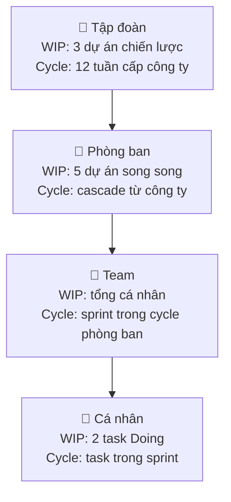
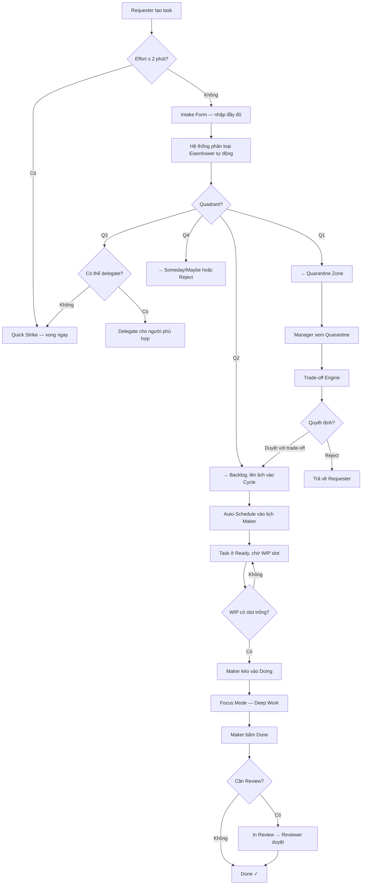
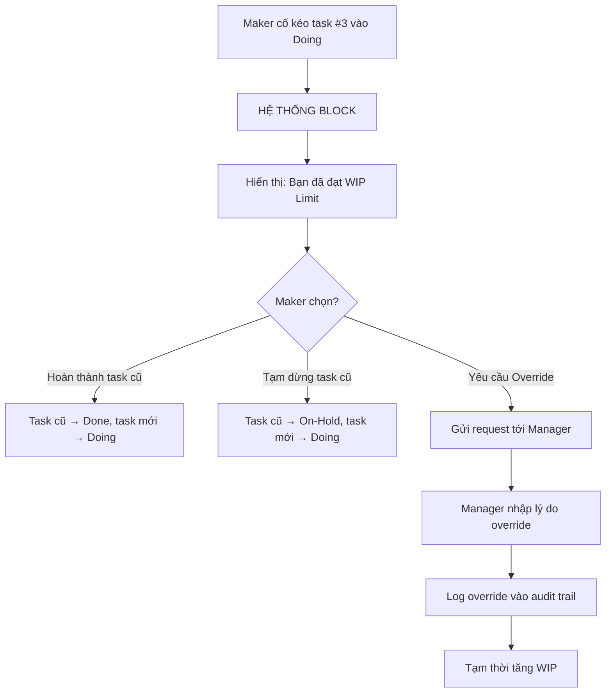
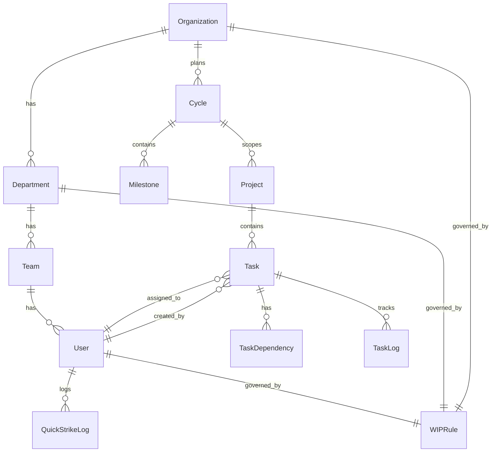

# TÀI LIỆU YÊU CẦU SẢN PHẨM (PRD)

## FlowGuard — Hệ thống Quản trị Task/Project định hướng Dòng chảy

**Phiên bản:** 1.0  
**Ngày:** 2026-03-18  

---

## MỤC LỤC

1. [Tầm nhìn & Bối cảnh](#1-tầm-nhìn--bối-cảnh)
2. [Triết lý & Nguyên lý Cốt lõi](#2-triết-lý--nguyên-lý-cốt-lõi)
3. [Cấu trúc Phân dạng — Khả năng Mở rộng](#3-cấu-trúc-phân-dạng--khả-năng-mở-rộng)
4. [Các Module & Tính năng Chính](#4-các-module--tính-năng-chính)
   - Module 1: The Border (Cửa khẩu & Đàm phán)
   - Module 2: The Bridge (Cầu nối Lập kế hoạch)
   - Module 3: The Territory (Lãnh thổ Thực thi)
   - Module 4: The Commons (Không gian Cộng tác) *(mới)*
   - Module 5: The Forge (Xưởng Tạo mẫu) *(mới)*
   - Module 6: The Lens (Ống kính Tìm kiếm) *(mới)*
5. [Luồng hoạt động tổng thể](#5-luồng-hoạt-động-tổng-thể)
6. [UI/UX Guidelines](#6-uiux-guidelines)
7. [Cấu trúc Dữ liệu](#7-cấu-trúc-dữ-liệu)
8. [Hệ thống Phân quyền & Vai trò](#8-hệ-thống-phân-quyền--vai-trò)
9. [Hệ thống Thông báo](#9-hệ-thống-thông-báo)
10. [Báo cáo & Phân tích](#10-báo-cáo--phân-tích)
11. [Tích hợp & API](#11-tích-hợp--api)
12. [Kế hoạch Triển khai theo Giai đoạn](#12-kế-hoạch-triển-khai-theo-giai-đoạn)
13. [Phi chức năng & Bảo mật](#13-phi-chức-năng--bảo-mật)
14. [Mobile & Responsive Strategy](#14-mobile--responsive-strategy) *(mới)*
15. [Onboarding & Help System](#15-onboarding--help-system) *(mới)*
16. [Phụ lục — Bảng Thuật ngữ](#16-phụ-lục--bảng-thuật-ngữ)

---

## 1. Tầm nhìn & Bối cảnh

### 1.1 Tuyên ngôn Sản phẩm

> FlowGuard **không** hướng tới giúp con người "làm được nhiều việc hơn cùng lúc".  
> FlowGuard hướng tới giúp họ **"hoàn thành trọn vẹn từng việc một"** với chất lượng cao nhất, không kiệt sức, và luôn kiểm soát được nhịp độ.

### 1.2 Vấn đề Cần giải quyết

| # | Vấn đề | Hệ quả |
|---|--------|--------|
| 1 | Nhân sự bị giao quá nhiều task đồng thời | Context-switching liên tục → giảm chất lượng, burnout |
| 2 | Task "khẩn cấp" liên tục chen ngang | Phá vỡ dòng chảy công việc, task cũ bị bỏ dở |
| 3 | Deadline được đặt cảm tính | Ước lượng sai → áp lực vô lý → chất lượng kém |
| 4 | Backlog khổng lồ gây ngợp | Hiệu ứng tâm lý tiêu cực, mất phương hướng |
| 5 | Không phân biệt Maker vs. Manager | Maker bị xé lẻ thời gian bởi họp hành, chat |
| 6 | Lộ trình năm dài lê thê | Mất động lực, không có cảm giác hoàn thành |

### 1.3 Đối tượng Người dùng

| Persona | Mô tả | Nhu cầu chính |
|---------|--------|---------------|
| **Solo Worker** | Freelancer, cá nhân tự quản lý | Kỷ luật WIP, Focus Mode, Quick Strike |
| **Team Lead / PM** | Quản lý team 3-15 người | Triage, phân bổ tải, theo dõi WIP team |
| **Executive / Director** | Quản lý cấp cao, nhiều phòng ban | Portfolio WIP, Cycle cascading, báo cáo tổng |
| **Maker** | Dev, Designer, Writer — người thực thi | Deep Work, tối giản giao diện, không bị chen ngang |
| **Observer** | Stakeholder, khách hàng | Xem tiến độ read-only, không can thiệp trực tiếp |

### 1.4 User Stories

#### Solo Worker

| ID | User Story | Acceptance Criteria |
|----|-----------|---------------------|
| US-01 | As a Solo Worker, I want to toggle between Maker Mode (execute) and Manager Mode (plan/triage) so that I can plan my week on Monday and deep-work the rest. | - Default: Monday AM = Manager Mode, rest = Maker Mode. - Toggle button luôn hiện. - Khi chuyển mode, giao diện thay đổi ngay lập tức. |
| US-02 | As a Solo Worker, I want the system to block me from exceeding my WIP limit so that I stay focused on finishing before starting new work. | - Khi kéo task thứ 3 vào Doing → hard block. - Hiển thị quick actions: hoàn thành / tạm dừng task hiện tại. |
| US-03 | As a Solo Worker, I want to set personal 12-week goals and see progress so that I maintain direction and momentum. | - Tạo Cycle cá nhân với ≥ 1 goal. - Dashboard hiển thị % hoàn thành + đếm ngược tuần. |

#### Team Lead / PM

| ID | User Story | Acceptance Criteria |
|----|-----------|---------------------|
| US-04 | As a PM, I want to see WIP heatmap of my team so that I can identify overloaded members before burnout. | - Heatmap hiển thị xanh (OK) / vàng (gần limit) / đỏ (vượt limit). - Click vào member → xem danh sách task Doing. |
| US-05 | As a PM, I want to process Quarantine tasks with mandatory trade-off so that urgent tasks don't silently overload my team. | - Quarantine zone hiển thị conflict analysis. - Bắt buộc chọn phương án trade-off + nhập lý do ≥ 20 ký tự. |
| US-06 | As a PM, I want the system to auto-schedule tasks into Maker calendar blocks so that I don't have to manually slot each task. | - Auto-schedule tạo block ≥ 2h cho Maker. - Không xếp chồng với meeting. - PM review & approve lịch đề xuất. |

#### Executive / Director

| ID | User Story | Acceptance Criteria |
|----|-----------|---------------------|
| US-07 | As an Executive, I want to see roll-up dashboard across departments so that I can monitor portfolio health at a glance. | - Dashboard hiển thị tất cả phòng ban với WIP status. - Drill-down: Org → Department → Team → Individual. |
| US-08 | As an Executive, I want Cycle cascading from company to department so that strategic goals are aligned at all levels. | - Tạo Company Cycle → auto-prompt Department Leads tạo sub-cycles. - Parent cycle progress tự tính từ child cycles. |

#### Maker

| ID | User Story | Acceptance Criteria |
|----|-----------|---------------------|
| US-09 | As a Maker, I want Focus Mode to hide all distractions so that I can enter deep work without context-switching. | - Bật Focus Mode → ẩn sidebar, chat, notifications (trừ Critical). - Giao diện monochrome. - Chỉ hiện: task name, description, timer, Done/Pause. |
| US-10 | As a Maker, when I complete a task, I want the next prioritized task to auto-pull into Doing so that I maintain flow. | - Khi Doing → Done, nếu WIP slot trống → task Ready ưu tiên cao nhất tự chuyển sang Doing. - Maker thấy notification nhẹ "Task mới đã sẵn sàng". |
| US-11 | As a Maker, I want Quick Strike for micro-tasks so that small interruptions don't pollute my main workflow. | - Floating bar ở góc dưới-phải. - Gõ + Enter = done. - Không ảnh hưởng WIP. - Giới hạn mô tả 50 ký tự. |
| US-12 | As a Maker, I want to self-create personal tasks that skip Triage for Q2 items so that I can manage my own improvement work. | - Maker tạo task → auto-classify Eisenhower. - Q2 (Not Urgent + Important) → vào personal Backlog trực tiếp. - Q1 → vẫn qua Quarantine. - Q3/Q4 → Quick Strike hoặc Someday. |

#### Observer

| ID | User Story | Acceptance Criteria |
|----|-----------|---------------------|
| US-13 | As an Observer, I want to view project progress read-only so that I can track delivery without interfering. | - Xem Cycle progress, milestone status. - Không thấy chi tiết WIP cá nhân, internal notes. |
| US-14 | As an Observer, I want to export reports as PDF/CSV so that I can share with stakeholders outside the system. | - Nút Export trên mọi dashboard Observer có quyền xem. - Format: PDF (styled), CSV (raw data). |
| US-15 | As an Observer, I want to receive notifications only on milestone completion so that I'm not overwhelmed by daily noise. | - Chỉ nhận: Milestone done, Cycle review published. - Không nhận: task updates, daily status. |

---

## 2. Triết lý & Nguyên lý Cốt lõi

### 2.1 Kim chỉ nam (Core Engine)

> **Bảo vệ Trạng thái Dòng chảy (Flow State) qua Giới hạn WIP**

Mọi tính năng, luồng dữ liệu và giao diện đều phải phục vụ một mục đích tối thượng:

- **Không bao giờ** để nhân sự vượt quá Giới hạn Công việc Đang làm (WIP Limit).
- Nút thắt cổ chai không nằm ở số lượng việc nhận vào, mà ở **số việc đang xử lý song song**.
- **Hoàn thành việc cũ** là điều kiện tiên quyết để mở khóa việc mới.
- Hệ thống phải chủ động **ngăn chặn** (không chỉ cảnh báo) việc vượt WIP.

**Quy tắc WIP chi tiết:**

| Cấp độ | WIP Limit mặc định | Có thể tùy chỉnh | Cần phê duyệt để vượt |
|---------|--------------------:|:-----------------:|:---------------------:|
| Cá nhân | 2 task Doing | ✅ (1-3) | Manager hoặc tự xác nhận lý do |
| Team | Tổng WIP = Σ cá nhân | ✅ | Team Lead |
| Phòng ban | Max 5 dự án song song | ✅ | Director |
| Công ty | Max 3 dự án chiến lược | ✅ | C-Level |

### 2.2 Các Nguyên lý Phụ trợ

#### NL-1: Vùng đệm Eisenhower (Eisenhower Buffer)

**Cơ sở:** Ma trận Eisenhower phân loại task theo 2 trục: Gấp (Urgent) × Quan trọng (Important).

**Quy tắc áp dụng:**

| Phân loại | Gấp | Quan trọng | Hành vi hệ thống |
|-----------|:---:|:----------:|-------------------|
| **Q1** — Crisis | ✅ | ✅ | → Quarantine Zone. Bắt buộc qua Triage. Manager phải trade-off. |
| **Q2** — Strategic | ❌ | ✅ | → Lên lịch vào Cycle. Đây là vùng vàng cần bảo vệ. |
| **Q3** — Interruption | ✅ | ❌ | → Delegate hoặc Quick Strike (nếu < 2 phút). |
| **Q4** — Noise | ❌ | ❌ | → Tự động reject hoặc lưu "Someday/Maybe". |

**Nguyên tắc vàng:** Task Q1 (Gấp & Quan trọng) **KHÔNG ĐƯỢC** đổ trực tiếp lên Maker. Phải đi qua bàn đàm phán (Triage) để Manager quyết định trade-off.

---

#### NL-2: Chu kỳ 12 Tuần (12-Week Cycle)

**Cơ sở:** Nghiên cứu của Brian P. Moran — "The 12 Week Year". Khoảng thời gian đủ ngắn để tạo urgency, đủ dài để hoàn thành mục tiêu có ý nghĩa.

**Quy tắc:**
- Mỗi Cycle = 12 tuần làm việc + 1 tuần buffer (review & planning cycle mới).
- Mọi dự án lớn phải được chia thành các mục tiêu dứt điểm trong 1 cycle.
- Không cho phép lên lịch task vượt ranh giới cycle hiện tại.
- Cuối cycle: bắt buộc **Cycle Review** — đánh giá % hoàn thành, rút bài học.
- Cycle cascading: Cycle công ty → Cycle phòng ban → Sprint/Task cá nhân.

**Cấu trúc Cycle:**

```
Cycle (12 tuần)
├── Milestone 1 (Tuần 1-4): Mục tiêu giai đoạn 1
├── Milestone 2 (Tuần 5-8): Mục tiêu giai đoạn 2
├── Milestone 3 (Tuần 9-12): Mục tiêu giai đoạn 3
└── Buffer Week (Tuần 13): Review & Plan
```

---

#### NL-3: Lịch Maker vs. Manager (Maker-Manager Schedule)

**Cơ sở:** Paul Graham — "Maker's Schedule, Manager's Schedule".

**Quy tắc:**

| Thuộc tính | Maker | Manager |
|------------|-------|---------|
| Đơn vị thời gian | Block ≥ 2h (lý tưởng 4h) | Slot 30-60 phút |
| Họp phép | Tối đa 1 cuộc/ngày, chỉ đầu hoặc cuối ngày | Linh hoạt |
| Thông báo | Chỉ @mention trực tiếp + Critical | Tất cả |
| Giao diện | Focus View (tối giản) | Dashboard tổng quan |
| Khi bật Focus Mode | Tắt chat, ẩn sidebar, monochrome | Không áp dụng |

**Auto-Schedule phải:**
- Tạo block ≥ 2h liên tục cho Maker.
- Không xếp họp giữa 2 block Deep Work.
- Đặt standup/sync vào đầu hoặc cuối ngày.

---

#### NL-4: Hiệu ứng Zeigarnik (Zeigarnik Effect Control)

**Cơ sở:** Tâm lý học — Não bộ bị ám ảnh bởi việc chưa hoàn thành.

**Quy tắc:**
- Giao diện Maker **chỉ hiển thị** task đang trong trạng thái `Doing`.
- Backlog **bị ẩn hoàn toàn** khỏi view mặc định của Maker.
- Khi Maker hoàn thành task → hệ thống tự động kéo task tiếp theo từ `Ready` → `Doing` (nếu còn slot WIP).
- Số lượng task chờ chỉ hiển thị dưới dạng 1 con số nhỏ (badge), không phải danh sách.

---

#### NL-5: Định luật Parkinson & Hệ số Hofstadter

**Cơ sở:**
- *Parkinson:* "Công việc luôn phình ra để lấp đầy thời gian được phân bổ."
- *Hofstadter:* "Mọi việc luôn mất nhiều thời gian hơn bạn nghĩ, kể cả khi bạn đã tính đến điều này."

**Quy tắc:**
- Khi tạo task, người giao bắt buộc nhập `Estimated Effort` (giờ thực tế làm việc).
- Hệ thống tự nhân với `Hofstadter Multiplier` (mặc định x1.3, tùy chỉnh theo lịch sử accuracy).
- **Maker KHÔNG thấy** multiplier — họ chỉ thấy Effort gốc để tránh Parkinson.
- Nếu `deadline yêu cầu < effort × multiplier` → Task bị gắn cờ → vào Quarantine.
- Hệ thống học từ dữ liệu lịch sử: nếu team thường xuyên trễ 40% → multiplier tự điều chỉnh lên x1.4.

**Công thức:**
```
Scheduled_Duration = Estimated_Effort × Hofstadter_Multiplier
If (Requested_Deadline < Now + Scheduled_Duration) → Quarantine
```

---

#### NL-6: Quy tắc 2 Phút (2-Minute Rule / Quick Strike)

**Cơ sở:** David Allen — "Getting Things Done". Việc dưới 2 phút thì làm ngay, không cần ghi chép.

**Quy tắc:**
- Quick Strike Bar: thanh floating input luôn hiện ở góc màn hình.
- Gõ mô tả → Enter → Đánh dấu xong ngay lập tức.
- **Không** lưu vào database chính (chỉ log nhẹ cho thống kê).
- **Không** ảnh hưởng WIP Limit.
- **Không** đi qua luồng Triage.
- Giới hạn: nếu mô tả > 50 ký tự hoặc effort > 2 phút → hệ thống gợi ý chuyển thành task chính thức.

---

## 3. Cấu trúc Phân dạng — Khả năng Mở rộng

### 3.1 Triết lý "Zoom Level"

Hệ thống áp dụng **cùng một bộ quy tắc** ở mọi cấp độ, chỉ khác "Mức độ thu phóng":



### 3.2 Chi tiết theo Cấp độ

#### Cấp độ 1: Cá nhân / Solo

| Khía cạnh | Chi tiết |
|-----------|----------|
| Vai trò | 1 người đóng cả Maker + Manager |
| WIP | Mặc định 2 task Doing |
| Lịch trình | Sáng Thứ 2 = Manager Mode (Triage, lên kế hoạch). Còn lại = Maker Mode |
| Cycle | Tự đặt 12-Week Goal cá nhân |
| Triage | Tự phân loại Eisenhower khi nhận task mới |
| Focus Mode | Tự bật/tắt, hệ thống nhắc nếu > 2h không bật |

#### Cấp độ 2: Team nhỏ (3-15 người)

| Khía cạnh | Chi tiết |
|-----------|----------|
| Vai trò | Tách biệt: PM/Lead = Manager, Dev/Designer = Maker |
| WIP | Mỗi Maker: 2 task. PM theo dõi tổng WIP team |
| Lịch trình | PM giữ Cửa khẩu (Triage). Maker trong Lãnh thổ (Deep Work) |
| Cycle | Team Cycle 12 tuần, chia thành 3 milestone |
| Triage | PM xử lý. Maker không bao giờ nhận task trực tiếp từ bên ngoài |
| Standup | Daily async (text) hoặc 15' đầu ngày |

#### Cấp độ 3: Phòng ban / Multi-team (15-100 người)

| Khía cạnh | Chi tiết |
|-----------|----------|
| Vai trò | Director → Team Lead → Maker. Thêm Observer cho stakeholder |
| WIP | Phòng ban: max 5 dự án. Team: tổng WIP cá nhân. Cá nhân: 2 task |
| Cycle | Phòng ban Cycle cascade từ Cycle công ty |
| Triage | 2 lớp: Director → Team Lead → Maker |
| Cross-team | Task liên team có dependency tracking |

#### Cấp độ 4: Công ty / Tập đoàn (100+ người)

| Khía cạnh | Chi tiết |
|-----------|----------|
| Vai trò | C-Level → Director → Team Lead → Maker. Phân quyền đa tầng |
| WIP | C-Level: max 3 OKR chiến lược. Cascade xuống từng tầng |
| Cycle | Cycle tập đoàn → Cycle phòng ban → Sprint team → Task cá nhân |
| Triage | Multi-layer với escalation path |
| Báo cáo | Roll-up dashboard từ cá nhân → team → phòng ban → công ty |

---

## 4. Các Module & Tính năng Chính

### Module 1: The Border (Cửa khẩu & Đàm phán)

> *Nơi tiếp nhận yêu cầu, áp dụng Eisenhower & Parkinson. Đây là "hàng rào" bảo vệ Maker khỏi nhiễu.*

#### 4.1.1 Intake Form (Đầu vào khắt khe)

**Trường bắt buộc:**

| Trường | Kiểu | Mô tả |
|--------|------|-------|
| `title` | String | Tên task rõ ràng, hành động (bắt đầu bằng động từ) |
| `description` | Rich Text | Mô tả chi tiết, acceptance criteria |
| `estimated_effort` | Duration | Thời gian thực tế dự kiến (giờ) |
| `urgency` | Enum | Urgent / Not Urgent |
| `importance` | Enum | Important / Not Important |
| `requested_deadline` | Date (tùy chọn) | Ngày mong muốn hoàn thành |
| `requester` | User | Người yêu cầu |
| `assignee_suggestion` | User (tùy chọn) | Gợi ý người thực hiện |

**Validation Rules:**
- `title` phải ≥ 10 ký tự, bắt đầu bằng động từ.
- `estimated_effort` bắt buộc > 0. Nếu = 0 → gợi ý Quick Strike.
- Nếu `estimated_effort` ≤ 2 phút → gợi ý Quick Strike thay vì tạo task.

**Xử lý tự động:**
```
eisenhower_quadrant = classify(urgency, importance)  // Q1, Q2, Q3, Q4
hofstadter_duration = estimated_effort × hofstadter_multiplier
is_feasible = (requested_deadline == null) OR (requested_deadline >= now + hofstadter_duration)
```

#### 4.1.2 Quarantine Zone (Vùng cách ly)

**Điều kiện vào Quarantine:**
- Task Q1 (Urgent + Important): luôn vào Quarantine trước.
- Task có `requested_deadline < now + hofstadter_duration`: deadline bất khả thi.
- Task được gắn manual flag "Cần review" bởi bất kỳ Manager nào.

**Trong Quarantine, task hiển thị:**
- Thời gian đã chờ trong quarantine.
- Conflict analysis: task nào của assignee sẽ bị ảnh hưởng nếu chen task này.
- Risk score: mức độ ảnh hưởng tới WIP hiện tại.

#### 4.1.3 Trade-off Engine (Công cụ đàm phán)

Để duyệt task từ Quarantine, Manager bắt buộc chọn **một trong các phương án:**

| Phương án | Mô tả | Hệ quả |
|-----------|--------|--------|
| **Hoán đổi** | Tạm dừng (On-Hold) task A đang Doing | Task A bị pause, ghi log lý do |
| **Tăng nguồn lực** | Thêm người cho task khẩn cấp | Split task, assign thêm member |
| **Giảm scope** | Cắt bớt yêu cầu của task khẩn cấp | Ghi lại scope đã bị cắt |
| **Dời deadline** | Đàm phán deadline mới với requester | Gửi notification cho requester |
| **Từ chối** | Reject task, trả về requester | Ghi lý do từ chối |

**Intentional Friction:** Mỗi trade-off yêu cầu:
1. Chọn phương án (1 click).
2. Nhập lý do bằng text (bắt buộc ≥ 20 ký tự).
3. Xác nhận lần cuối ("Tôi hiểu rằng điều này sẽ ảnh hưởng tới...").

---

### Module 2: The Bridge (Cầu nối Lập kế hoạch)

> *Nơi áp dụng Chu kỳ 12 Tuần và Auto-Scheduling.*

#### 4.2.1 Cycle Dashboard

**Hiển thị:**
- Cycle hiện tại với đếm ngược: "Tuần 3/12 — Còn 63 ngày".
- Progress bar theo milestone (3 milestone/cycle).
- Burndown chart đơn giản (effort còn lại vs. thời gian).
- Danh sách Cycle Goals với % hoàn thành.

**Quy tắc:**
- Không cho phép tạo task có deadline vượt ranh giới cycle hiện tại.
- Khi tạo task mới, tự động gắn vào cycle đang active.
- Cuối cycle: lock cycle, bắt buộc Cycle Review trước khi mở cycle mới.
- Task chưa xong cuối cycle → tự động chuyển sang cycle mới với flag "Carried Over".

#### 4.2.2 Auto-Scheduling Engine

**Input:**
- Danh sách task `Ready` với `hofstadter_duration`.
- Lịch trống từng nhân sự (calendar integration).
- Role type (Maker/Manager) để xác định block size tối thiểu.
- Task priority & dependencies.

**Output:**
- Lịch đề xuất với các block thời gian cho từng task.
- Maker: block ≥ 2h liên tục, lý tưởng 4h.
- Không xếp task vào slot đã có meeting.
- Gaps nhỏ (< 30 phút) được đánh dấu "Buffer" — không xếp task.

**Conflict Resolution:**
- Nếu không đủ slot → thông báo Manager: "Team đã full capacity, cần trade-off."
- Suggestion: task nào có thể dời, task nào cần thêm người.

#### 4.2.3 Dependency Management

```
Task A ──blocks──► Task B ──blocks──► Task C
```

- Khi Task A chưa `Done`, Task B không thể chuyển sang `Doing`.
- Hệ thống hiển thị critical path: chuỗi dependency dài nhất ảnh hưởng tới milestone.
- Auto-alert khi task trên critical path bị trễ.

---

### Module 3: The Territory (Lãnh thổ Thực thi)

> *Nơi áp dụng WIP Limit, Lịch Maker & Zeigarnik. "Lãnh thổ" thiêng liêng của Maker.*

#### 4.3.1 Strict WIP Enforcement

**Cơ chế:**
- Mỗi cá nhân có `wip_limit` slot cho trạng thái `Doing` (mặc định: 2).
- Khi kéo task thứ 3 vào `Doing`:
  1. Hệ thống **block** hành động (không phải cảnh báo).
  2. Hiển thị: *"Bạn đang có {n} task Doing. Vui lòng hoàn thành hoặc tạm dừng 1 task trước."*
  3. Cung cấp quick actions: `Hoàn thành Task A` | `Tạm dừng Task A` | `Hủy`
- Override chỉ khả dụng cho Manager, yêu cầu nhập lý do.
- Mọi WIP override đều được log và hiện trong báo cáo.

#### 4.3.2 Focus View (Chế độ Deep Work)

**Khi Maker bấm "Start" một task:**
- Giao diện chuyển sang **monochrome/tối giản**.
- Chỉ hiển thị: Tên task, Mô tả/Acceptance Criteria, Tài liệu đính kèm, Timer, Nút `Done` / `Pause`.
- **Ẩn:** Sidebar, navigation, backlog badge, chat, notification (trừ Critical).
- **Pomodoro tích hợp (tùy chọn):** 25 phút focus → 5 phút break.
- Khi thoát Focus Mode → hệ thống hỏi: *"Bạn đã hoàn thành phần nào? Ghi chú nhanh (tùy chọn)."*

#### 4.3.3 Quick Strike Bar

- Thanh floating input ở góc dưới-phải màn hình (luôn hiện, mọi view).
- Gõ mô tả → Enter → Done ngay. Không modal, không form phức tạp.
- Lưu vào `quick_strike_log` (bảng riêng, nhẹ), không vào task chính.
- Thống kê: bao nhiêu Quick Strike/ngày, tổng thời gian tiết kiệm.
- Không ảnh hưởng WIP, không ảnh hưởng cycle metrics.

#### 4.3.4 Task Status Flow

```
                    ┌─────────────────────────────────┐
                    │                                 │
                    ▼                                 │
Intake → Backlog → Quarantine ──trade-off──► Ready → Doing → In Review → Done
                    │              │                    │         │
                    │              └──reject──► Rejected │         │
                    │                                   │         │
                    └──────────────────────────────────►On-Hold◄──┘
```

| Trạng thái | Mô tả | Ai thấy |
|------------|--------|---------|
| `Intake` | Vừa được tạo, chưa phân loại | Manager |
| `Backlog` | Đã phân loại, chờ lên lịch | Manager |
| `Quarantine` | Cần đàm phán (Q1 hoặc deadline conflict) | Manager |
| `Ready` | Đã được duyệt và lên lịch, chờ slot WIP | Manager + Maker (badge) |
| `Doing` | Đang thực hiện (chặn bởi WIP Limit) | Maker (chính) |
| `On-Hold` | Tạm dừng (trade-off hoặc blocked) | Manager + Maker |
| `In Review` | Hoàn thành, đang chờ review/QA | Manager + Reviewer |
| `Done` | Hoàn tất | Tất cả (trong report) |
| `Rejected` | Bị từ chối tại Triage | Requester |

#### 4.3.5 Edge Case Rules

**In Review: Reject Flow**
- Reviewer bấm "Request Changes" → task quay về `Doing` (không về Ready).
- Assignee nhận notification + review comments.
- Không tiêu thêm WIP slot (vì task đã ở Doing trước đó).
- Nếu assignee đã đạt WIP limit → task vào `On-Hold` kèm flag "Review Returned", Manager must intervene.

**On-Hold: Timeout & Escalation**
- Task On-Hold > 3 ngày → auto-reminder cho Assignee + Manager.
- Task On-Hold > 7 ngày → escalation lên cấp trên (Team Lead → Director).
- Task On-Hold > 14 ngày → auto-move về `Backlog` + flag "Stalled" + bắt buộc Manager review lại priority.

**Carried Over: Limit Rule**
- Task carried over 1 lần → flag "Carried Over" (vàng).
- Task carried over 2 lần → flag "Chronic Carry" (đỏ) + bắt buộc Manager review: giữ / split / cancel.
- Task carried over 3 lần → auto-escalate lên Director, bắt buộc quyết định trong 3 ngày.

**Maker Self-Created Tasks (xem US-12)**
- Maker tạo task cho mình → auto-classify Eisenhower.
- Q2 (Not Urgent + Important) → vào personal `Backlog` trực tiếp (skip Triage).
- Q1 → vẫn qua `Quarantine` bình thường.
- Q3/Q4 → gợi ý Quick Strike hoặc Someday/Maybe.

---

### Module 4: The Commons (Không gian Cộng tác)

> *Nơi giao tiếp về task diễn ra có kiểm soát — không phá Flow State nhưng vẫn đảm bảo truyền thông tin.*

#### 4.4.1 Task Comments & Discussions

**Quy tắc:**
- Mỗi task có **comment thread** — nơi duy nhất trao đổi về task đó.
- Comment hỗ trợ **@mention** để tag người liên quan.
- Maker đang trong Focus Mode **KHÔNG** nhận notification comment (trừ @mention trực tiếp + Critical).
- Comment tự động đính kèm timestamp + role badge (Maker/Manager/Observer).

**Loại comment:**

| Loại | Icon | Mô tả | Notification |
|------|------|--------|-------------|
| General | 💬 | Thảo luận chung | @mention only |
| Decision | ⚖️ | Quyết định quan trọng (pin-able) | All followers |
| Blocker | 🚫 | Báo cáo task bị block | Manager + Assignee |
| Handoff | 🤝 | Chuyển giao context giữa người | Receiver |

#### 4.4.2 File Attachments

- Đính kèm file vào task: deliverables, designs, specs, screenshots.
- Giới hạn: 50MB/file, 500MB/project.
- Preview inline cho: images, PDF, Markdown, code files.
- Version tracking: upload lại file cùng tên → giữ lịch sử phiên bản.

#### 4.4.3 Activity Feed

- Mỗi task có **timeline tự động** ghi lại mọi thay đổi:
  - Status change, assignee change, comment, attachment, WIP override.
- Project-level activity feed tổng hợp từ tất cả task.
- Filter theo: loại action, người thực hiện, khoảng thời gian.

---

### Module 5: The Forge (Xưởng Tạo mẫu)

> *Nơi chuẩn hóa luồng công việc lặp lại — tiết kiệm thời gian và đảm bảo consistency.*

#### 4.5.1 Task Templates

**Tính năng:**
- Tạo template task với pre-filled fields: title prefix, description, estimated_effort, labels, checklist.
- Template library phân loại: Engineering, Design, Marketing, Operations...
- Khi tạo task từ template → pre-fill → user chỉnh sửa → submit.

**Ví dụ templates mặc định:**
| Template | Pre-filled fields |
|----------|-------------------|
| Bug Fix | Title: "Fix: ...", Labels: [bug], Effort: 2h |
| Feature | Title: "Implement: ...", Labels: [feature], Effort: 8h, Checklist: [Design, Code, Test, Review] |
| Code Review | Title: "Review: ...", Labels: [review], Effort: 1h |
| Sprint Retrospective | Title: "Sprint X Retro", Labels: [meeting], Effort: 1h |

#### 4.5.2 Recurring Tasks

**Cơ chế:**
- Tạo recurring rule: daily, weekly, bi-weekly, monthly, custom cron.
- Hệ thống auto-create task instance vào đầu mỗi period.
- Task instance liên kết với recurring rule nhưng có thể chỉnh sửa độc lập.
- Nếu instance cũ chưa Done khi instance mới tạo → flag "Overdue Recurring".

**Quy tắc:** Recurring task **KHÔNG** tự động vào Doing — vẫn tuân theo WIP Limit. Nó vào `Ready` và chờ slot.

#### 4.5.3 Project Templates

- Clone toàn bộ cấu trúc project: task list (ko data), milestone structure, labels, roles.
- Dùng cho dự án có quy trình tương tự (VD: mỗi lần launch website mới).

---

### Module 6: The Lens (Ống kính Tìm kiếm)

> *Nơi truy vấn nhanh mọi thông tin — tìm task, lọc dữ liệu, lưu view cá nhân.*

#### 4.6.1 Global Search

- **Full-text search** trên: task title, description, comments, attachment names.
- Kết quả hiển thị grouped by: Tasks, Projects, Comments, Attachments.
- Search hotkey: `Cmd/Ctrl + K` → command palette.
- Recent searches + suggested searches.

#### 4.6.2 Advanced Filters

| Filter | Options |
|--------|---------|
| Status | Intake, Backlog, Quarantine, Ready, Doing, On-Hold, In Review, Done, Rejected |
| Assignee | User list + "Unassigned" |
| Eisenhower | Q1, Q2, Q3, Q4 |
| Priority | Critical, High, Medium, Low |
| Cycle | Current, Specific cycle, Carried Over |
| Project | Project list |
| Date range | Created, Deadline, Completed |
| Labels/Tags | User-defined labels |
| Effort | Range slider (hours) |

#### 4.6.3 Saved Views & Custom Dashboards

- User lưu filter combination thành **Saved View** (VD: "My Overdue Tasks", "Team Q1 Crisises").
- Saved View có thể set làm default view.
- Share Saved View với team.
- Pin Saved View vào sidebar.

---

## 5. Luồng Hoạt động Tổng thể

### 5.1 Luồng Tạo & Xử lý Task



### 5.2 Luồng Override WIP (Exceptional Flow)



---

## 6. UI/UX Guidelines

### 6.1 Nguyên tắc Thiết kế Tổng quát

| # | Nguyên tắc | Mô tả |
|---|-----------|-------|
| 1 | **Tối giản thị giác** | Monochrome làm chủ đạo. Màu sắc chỉ là tín hiệu báo động chiến lược. |
| 2 | **Chống nhiễu** | Maker không thấy chart/graph. Chỉ thấy: Tên task, Tài liệu, Nút Done. |
| 3 | **Rào cản có chủ đích** | Hành vi phá kỷ luật (vượt WIP, chen task gấp) yêu cầu nhiều bước xác nhận. |
| 4 | **Context-aware** | Giao diện thay đổi theo Role (Maker/Manager/Observer). |
| 5 | **Progressive disclosure** | Thông tin phức tạp ẩn sau interaction, không dump hết lên màn hình. |

### 6.2 Bảng Màu Chiến lược

| Màu | Hex | Sử dụng | Khi nào |
|-----|-----|---------|---------|
| Monochrome | `#1A1A1A` / `#F5F5F5` | Nền, text, border mặc định | Luôn luôn |
| 🔴 Đỏ | `#E53935` | Cảnh báo nghiêm trọng | Vượt WIP, task overdue, system error |
| 🟠 Cam | `#FB8C00` | Cảnh báo nhẹ | Task trong Quarantine, deadline gần |
| 🟢 Xanh lá | `#43A047` | Thành công | Task Done, Cycle hoàn thành, WIP OK |
| 🔵 Xanh dương | `#1E88E5` | Thông tin / Tương tác | Link, button chính, Focus Mode active |

### 6.3 Views theo Role

**Maker View:**
- Default: Focus View — chỉ task đang `Doing`.
- Sidebar thu gọn: badge số task `Ready`.
- Quick Strike Bar ở góc dưới-phải.
- Không thấy: Quarantine, Backlog list, Triage, Analytics.

**Manager View:**
- Default: Board View — Kanban columns theo status.
- Quarantine Zone nổi bật ở trên cùng (nếu có task).
- WIP heatmap: hiển thị workload từng member.
- Cycle progress bar.
- Trade-off history log.

**Observer View:**
- Read-only dashboard.
- Cycle progress, milestone status.
- Không thấy: chi tiết task, WIP cá nhân, internal notes.
- Export báo cáo dạng PDF/CSV.

---

## 7. Cấu trúc Dữ liệu

### 7.1 Entity Relationship Diagram



### 7.2 Core Tables

#### `users`
| Cột | Kiểu | Mô tả |
|-----|------|-------|
| `id` | UUID PK | |
| `name` | VARCHAR(255) | |
| `email` | VARCHAR(255) UNIQUE | |
| `role_type` | ENUM('maker','manager','observer','admin') | Xác định view mặc định |
| `organization_id` | FK → organizations | |
| `department_id` | FK → departments | nullable |
| `team_id` | FK → teams | nullable |
| `maker_block_min_hours` | DECIMAL(3,1) | Block tối thiểu cho Deep Work (default 2.0) |
| `personal_wip_limit` | INT | Override cá nhân (default: từ WIPRule) |
| `hofstadter_multiplier` | DECIMAL(3,2) | Cá nhân hóa dựa trên lịch sử (default 1.30) |

#### `cycles`
| Cột | Kiểu | Mô tả |
|-----|------|-------|
| `id` | UUID PK | |
| `name` | VARCHAR(255) | VD: "Q1-2026 Cycle" |
| `organization_id` | FK | |
| `parent_cycle_id` | FK → cycles | nullable, cho cascade |
| `start_date` | DATE | |
| `end_date` | DATE | = start_date + 12 weeks |
| `buffer_week_start` | DATE | Tuần 13 |
| `status` | ENUM('planning','active','review','closed') | |
| `goals` | JSONB | Danh sách mục tiêu cycle |

#### `projects`
| Cột | Kiểu | Mô tả |
|-----|------|-------|
| `id` | UUID PK | |
| `name` | VARCHAR(255) | |
| `cycle_id` | FK → cycles | Bắt buộc thuộc 1 cycle |
| `owner_id` | FK → users | PM/Lead |
| `status` | ENUM('planning','active','on-hold','completed','archived') | |
| `priority` | ENUM('critical','high','medium','low') | |

#### `tasks`
| Cột | Kiểu | Mô tả |
|-----|------|-------|
| `id` | UUID PK | |
| `title` | VARCHAR(500) | Bắt đầu bằng động từ |
| `description` | TEXT | Rich text, acceptance criteria |
| `project_id` | FK → projects | |
| `created_by` | FK → users | Requester |
| `assigned_to` | FK → users | nullable |
| `status` | ENUM (xem Status Flow ở §4.3.4) | |
| `eisenhower_quadrant` | ENUM('Q1','Q2','Q3','Q4') | Auto-classified |
| `estimated_effort_hours` | DECIMAL(5,2) | Effort gốc (giờ) |
| `hofstadter_multiplier` | DECIMAL(3,2) | Ẩn với Maker |
| `scheduled_duration_hours` | DECIMAL(5,2) | = effort × multiplier |
| `requested_deadline` | TIMESTAMP | nullable |
| `scheduled_start` | TIMESTAMP | Từ Auto-Schedule |
| `scheduled_end` | TIMESTAMP | |
| `actual_start` | TIMESTAMP | Khi chuyển sang Doing |
| `actual_end` | TIMESTAMP | Khi chuyển sang Done |
| `priority` | INT | Thứ tự ưu tiên trong Ready queue |
| `cycle_id` | FK → cycles | |
| `carried_over_from` | FK → cycles | nullable, nếu task từ cycle cũ |

#### `task_dependencies`
| Cột | Kiểu | Mô tả |
|-----|------|-------|
| `id` | UUID PK | |
| `task_id` | FK → tasks | Task bị block |
| `depends_on_task_id` | FK → tasks | Task phải xong trước |
| `dependency_type` | ENUM('blocks','relates_to') | |

#### `wip_rules`
| Cột | Kiểu | Mô tả |
|-----|------|-------|
| `id` | UUID PK | |
| `scope_type` | ENUM('user','team','department','organization') | |
| `scope_id` | UUID | FK tới bảng tương ứng |
| `max_doing` | INT | Số task Doing tối đa |
| `max_projects` | INT | nullable, cho scope department/org |
| `can_override` | BOOLEAN | Manager có thể override không |

#### `trade_off_logs`
| Cột | Kiểu | Mô tả |
|-----|------|-------|
| `id` | UUID PK | |
| `task_id` | FK → tasks | Task được duyệt từ Quarantine |
| `decided_by` | FK → users | Manager |
| `decision` | ENUM('swap','add_resource','reduce_scope','extend_deadline','reject') | |
| `affected_task_id` | FK → tasks | nullable, task bị ảnh hưởng |
| `reason` | TEXT | Bắt buộc ≥ 20 ký tự |
| `decided_at` | TIMESTAMP | |

#### `quick_strike_log`
| Cột | Kiểu | Mô tả |
|-----|------|-------|
| `id` | UUID PK | |
| `user_id` | FK → users | |
| `description` | VARCHAR(200) | |
| `completed_at` | TIMESTAMP | |

#### `task_logs` (Audit Trail)
| Cột | Kiểu | Mô tả |
|-----|------|-------|
| `id` | UUID PK | |
| `task_id` | FK → tasks | |
| `user_id` | FK → users | Người thực hiện hành động |
| `action` | VARCHAR(50) | VD: 'status_change', 'wip_override', 'reassign' |
| `from_value` | VARCHAR(255) | nullable |
| `to_value` | VARCHAR(255) | nullable |
| `note` | TEXT | nullable |
| `created_at` | TIMESTAMP | |

#### `comments`
| Cột | Kiểu | Mô tả |
|-----|------|-------|
| `id` | UUID PK | |
| `task_id` | FK → tasks | |
| `user_id` | FK → users | Người comment |
| `content` | TEXT | Nội dung comment (Markdown) |
| `comment_type` | ENUM('general','decision','blocker','handoff') | Loại comment |
| `is_pinned` | BOOLEAN | Decision comments có thể pin |
| `parent_comment_id` | FK → comments | nullable, cho reply thread |
| `created_at` | TIMESTAMP | |
| `updated_at` | TIMESTAMP | |

#### `attachments`
| Cột | Kiểu | Mô tả |
|-----|------|-------|
| `id` | UUID PK | |
| `task_id` | FK → tasks | |
| `uploaded_by` | FK → users | |
| `file_name` | VARCHAR(500) | Tên file gốc |
| `file_path` | VARCHAR(1000) | Đường dẫn storage (S3/GCS) |
| `file_size_bytes` | BIGINT | Kích thước file |
| `mime_type` | VARCHAR(100) | VD: 'image/png', 'application/pdf' |
| `version` | INT | Auto-increment khi upload cùng tên |
| `created_at` | TIMESTAMP | |

#### `tags`
| Cột | Kiểu | Mô tả |
|-----|------|-------|
| `id` | UUID PK | |
| `name` | VARCHAR(100) UNIQUE | Tên tag |
| `color` | VARCHAR(7) | Hex color |
| `organization_id` | FK → organizations | Scope tag theo org |

#### `task_tags` (junction table)
| Cột | Kiểu | Mô tả |
|-----|------|-------|
| `task_id` | FK → tasks | PK composite |
| `tag_id` | FK → tags | PK composite |

#### `task_templates`
| Cột | Kiểu | Mô tả |
|-----|------|-------|
| `id` | UUID PK | |
| `name` | VARCHAR(255) | Tên template |
| `category` | VARCHAR(100) | Engineering, Design, Marketing... |
| `title_prefix` | VARCHAR(100) | VD: "Fix: ", "Implement: " |
| `description_template` | TEXT | Template cho description |
| `default_effort_hours` | DECIMAL(5,2) | Effort mặc định |
| `default_labels` | JSONB | Labels mặc định |
| `checklist_template` | JSONB | Checklist items mặc định |
| `organization_id` | FK → organizations | |
| `created_by` | FK → users | |

#### `recurring_rules`
| Cột | Kiểu | Mô tả |
|-----|------|-------|
| `id` | UUID PK | |
| `template_id` | FK → task_templates | nullable |
| `title_pattern` | VARCHAR(500) | VD: "Weekly Standup - Week {week_num}" |
| `recurrence_type` | ENUM('daily','weekly','biweekly','monthly','custom') | |
| `cron_expression` | VARCHAR(100) | nullable, cho custom |
| `assigned_to` | FK → users | nullable |
| `project_id` | FK → projects | nullable |
| `is_active` | BOOLEAN | Bật/tắt recurring |
| `last_generated_at` | TIMESTAMP | Lần cuối tạo instance |
| `created_by` | FK → users | |

#### `notifications`
| Cột | Kiểu | Mô tả |
|-----|------|-------|
| `id` | UUID PK | |
| `user_id` | FK → users | Người nhận |
| `type` | ENUM('critical','important','info','silent') | Mức độ |
| `title` | VARCHAR(255) | |
| `content` | TEXT | |
| `related_task_id` | FK → tasks | nullable |
| `channel` | ENUM('push','in_app','email','badge') | |
| `is_read` | BOOLEAN | |
| `created_at` | TIMESTAMP | |

#### `focus_sessions`
| Cột | Kiểu | Mô tả |
|-----|------|-------|
| `id` | UUID PK | |
| `user_id` | FK → users | |
| `task_id` | FK → tasks | |
| `started_at` | TIMESTAMP | Bật Focus Mode |
| `ended_at` | TIMESTAMP | nullable, tắt Focus Mode |
| `duration_minutes` | INT | Computed |
| `exit_note` | TEXT | nullable, ghi chú khi thoát |
| `pomodoro_count` | INT | Số pomodoro hoàn thành |

#### `cycle_reviews`
| Cột | Kiểu | Mô tả |
|-----|------|-------|
| `id` | UUID PK | |
| `cycle_id` | FK → cycles | |
| `reviewed_by` | FK → users | |
| `completion_rate` | DECIMAL(5,2) | % task Done / planned |
| `carry_over_count` | INT | Số task bị carried over |
| `lessons_learned` | TEXT | Bài học rút ra |
| `improvement_actions` | JSONB | Action items cho cycle mới |
| `reviewed_at` | TIMESTAMP | |

#### `user_preferences`
| Cột | Kiểu | Mô tả |
|-----|------|-------|
| `user_id` | FK → users | PK |
| `theme` | ENUM('light','dark','auto') | |
| `language` | VARCHAR(5) | VD: 'vi', 'en' |
| `notification_channels` | JSONB | Tùy chỉnh kênh thông báo |
| `default_view` | VARCHAR(50) | VD: 'focus', 'board', 'list' |
| `timezone` | VARCHAR(50) | |
| `focus_mode_auto_dnd` | BOOLEAN | Tự bật DND trên calendar |

#### `saved_views`
| Cột | Kiểu | Mô tả |
|-----|------|-------|
| `id` | UUID PK | |
| `user_id` | FK → users | Người tạo |
| `name` | VARCHAR(255) | Tên view |
| `filters` | JSONB | Filter configuration |
| `is_default` | BOOLEAN | Là default view? |
| `is_shared` | BOOLEAN | Chia sẻ với team? |
| `team_id` | FK → teams | nullable, scope share |

### 7.3 Database Indexes

| Index | Columns | Mục đích |
|-------|---------|----------|
| `idx_tasks_assignee_status` | `(assigned_to, status)` | Query WIP nhanh |
| `idx_tasks_cycle_status` | `(cycle_id, status)` | Cycle Dashboard |
| `idx_tasks_project_status` | `(project_id, status)` | Project Kanban |
| `idx_tasks_eisenhower` | `(eisenhower_quadrant, status)` | Quarantine filter |
| `idx_tasks_fulltext` | `(title, description)` GIN | Full-text search |
| `idx_comments_task` | `(task_id, created_at)` | Comment thread |
| `idx_notifications_user` | `(user_id, is_read, created_at)` | Notification feed |
| `idx_focus_sessions_user` | `(user_id, started_at)` | Focus time report |
| `idx_task_logs_task` | `(task_id, created_at)` | Activity feed |

---

## 8. Hệ thống Phân quyền & Vai trò

### 8.1 Ma trận Phân quyền

| Hành động | Admin | Manager | Maker | Observer |
|-----------|:-----:|:-------:|:-----:|:--------:|
| Tạo task | ✅ | ✅ | ✅ (chỉ cho mình) | ❌ |
| Triage / Duyệt task | ✅ | ✅ | ❌ | ❌ |
| Trade-off Quarantine | ✅ | ✅ | ❌ | ❌ |
| Override WIP | ✅ | ✅ | ❌ | ❌ |
| Chuyển task sang Doing | ✅ | ✅ | ✅ (task của mình) | ❌ |
| Bấm Done | ✅ | ✅ | ✅ (task của mình) | ❌ |
| Xem Backlog | ✅ | ✅ | ❌ (chỉ badge count) | ❌ |
| Xem Quarantine | ✅ | ✅ | ❌ | ❌ |
| Xem Focus View | ✅ | ❌ | ✅ | ❌ |
| Cấu hình WIP Rules | ✅ | ✅ (team mình) | ❌ | ❌ |
| Tạo/Quản lý Cycle | ✅ | ✅ | ❌ | ❌ |
| Xem Report/Dashboard | ✅ | ✅ | ✅ (của mình) | ✅ (read-only, limited) |
| Quản lý Users | ✅ | ❌ | ❌ | ❌ |

---

## 9. Hệ thống Thông báo

### 9.1 Nguyên tắc Thông báo

> **Thông báo phải bảo vệ Flow State, không phá vỡ nó.**

| Vai trò | Nhận thông báo | Không nhận |
|---------|---------------|------------|
| **Maker (Focus Mode ON)** | Chỉ: task bị block, system critical | Mọi thứ khác |
| **Maker (Focus Mode OFF)** | @mention trực tiếp, task assigned, task deadline gần | Chat group, updates từ task không liên quan |
| **Manager** | Quarantine mới, WIP violation, Cycle milestones, trade-off requests | Maker progress updates (tự xem dashboard) |
| **Observer** | Milestone hoàn thành, Cycle review | Chi tiết task, daily updates |

### 9.2 Kênh Thông báo

| Loại | Kênh | Ví dụ |
|------|------|-------|
| Critical | Push + In-app + Email | WIP violation, System down |
| Important | In-app + Email | Task assigned, Quarantine needs attention |
| Info | In-app only | Task status update, Comment |
| Silent | Badge only | Backlog count change |

---

## 10. Báo cáo & Phân tích

### 10.1 Dashboard theo Role

**Manager Dashboard:**
- WIP Heatmap: workload từng member (xanh/vàng/đỏ).
- Cycle Burndown: effort còn lại vs. thời gian.
- Quarantine Queue: task đang chờ trade-off.
- Throughput: task Done/tuần (trend line).
- Carried Over Rate: % task bị mang sang cycle mới.
- Override Frequency: số lần WIP override/tuần.

**Personal Dashboard (Maker):**
- Focus Time: tổng giờ Deep Work / tuần.
- Completion Rate: task Done / task assigned.
- Estimation Accuracy: actual vs. estimated (để calibrate Hofstadter).
- Quick Strike count: micro-task xử lý / tuần.

**Executive Dashboard:**
- Portfolio Health: các dự án chiến lược với status.
- Cycle Progress: tổng % hoàn thành across departments.
- Department WIP: workload tổng từng phòng ban.
- Strategic OKR alignment.

### 10.2 Metric tự động

| Metric | Công thức | Mục đích |
|--------|-----------|----------|
| Flow Efficiency | `Doing time / (Doing + Waiting time)` | Đo thời gian thực sự làm vs. chờ |
| WIP Compliance | `1 - (override_count / total_transitions)` | Đo kỷ luật WIP |
| Estimation Accuracy | `actual_hours / estimated_hours` | Calibrate Hofstadter |
| Cycle Completion | `done_tasks / planned_tasks × 100%` | Đo khả năng lập kế hoạch |
| Carry-over Rate | `carried_tasks / total_tasks × 100%` | Đo tính khả thi của planning |

---

## 11. Tích hợp & API

### 11.1 Calendar Integration

- Google Calendar, Outlook: đồng bộ 2 chiều lịch trống cho Auto-Schedule.
- Khi Maker bật Focus Mode → tự động tạo "Do Not Disturb" event trên calendar.
- Sync lịch meeting → Auto-Schedule không xếp task vào slot đã có meeting.

### 11.2 Communication Integration

- Slack / Teams: gửi notification theo quy tắc §9.
- Khi Maker trong Focus Mode → set Slack status "🔴 Deep Work — Do Not Disturb".
- Slash commands: `/flowguard done` (mark task done từ Slack), `/flowguard quick [mô tả]` (Quick Strike).
- Bot alerts: WIP violation, Quarantine mới, Cycle milestone.

### 11.3 Dev Tools Integration

- **GitHub / GitLab:**
  - Link PR/MR tới task → auto-update status (PR merged → task In Review).
  - Branch naming convention: `task/{task_id}/{short-title}`.
  - Commit message linking: `[FG-{task_id}]` prefix.
- **CI/CD:**
  - Webhook trigger khi task status change (VD: Doing → In Review → trigger test suite).
  - Deploy status feedback → task comment tự động.

### 11.4 API Design

**Versioning:**
- URL-based versioning: `/api/v1/tasks`, `/api/v2/tasks`.
- Deprecation policy: v(N-2) maintained, v(N-3) sunset after 6 months.

**Authentication:**
- API Key cho server-to-server integration.
- OAuth 2.0 cho third-party apps.
- Personal Access Token cho automation scripts.

**Rate Limiting:**

| Endpoint group | Rate limit | Burst |
|---------------|-----------|-------|
| Read (GET) | 1000 req/min | 50 req/s |
| Write (POST/PUT/DELETE) | 200 req/min | 20 req/s |
| Intake (task creation) | 50 req/min | 5 req/s |
| Search | 100 req/min | 10 req/s |
| File Upload | 20 req/min | 2 req/s |

**Core Endpoints:**

| Method | Endpoint | Mô tả |
|--------|----------|--------|
| POST | `/api/v1/tasks` | Tạo task (qua Intake validation) |
| GET | `/api/v1/tasks/{id}` | Chi tiết task |
| PATCH | `/api/v1/tasks/{id}/status` | Chuyển status (tuân theo WIP rule) |
| GET | `/api/v1/users/{id}/wip` | WIP status hiện tại |
| GET | `/api/v1/cycles/current` | Cycle đang active |
| POST | `/api/v1/quick-strike` | Quick Strike |
| GET | `/api/v1/search?q=` | Full-text search |
| POST | `/api/v1/tasks/bulk` | Bulk create/update |

**WebSocket Events:**

| Event | Payload | Subscriber |
|-------|---------|-----------|
| `task.status_changed` | task_id, from, to, user | Board viewers |
| `wip.violation` | user_id, current_count, limit | Manager |
| `quarantine.new` | task_id, reason | Manager |
| `focus.started` | user_id, task_id | Team members |
| `cycle.milestone_reached` | cycle_id, milestone | All |

### 11.5 Webhook Events

- Webhook endpoint configuration qua UI (URL, secret, events).
- Retry policy: 3 lần với exponential backoff (1s, 5s, 25s).
- Webhook log với response status cho debugging.

**Events có thể subscribe:**
`task.created`, `task.status_changed`, `task.assigned`, `task.completed`, `wip.override`, `cycle.started`, `cycle.completed`, `quarantine.escalated`, `trade_off.decided`.

### 11.6 Data Import / Export

- **Import:** CSV/JSON import cho tasks (mapping columns → fields).
- **Migration tools:** Import từ Jira, Asana, Trello, Monday (field mapping wizard).
- **Export:** CSV, JSON, PDF report.
- **Bulk API:** `/api/v1/tasks/bulk` cho programmatic import (max 100 tasks/request).

---

## 12. Kế hoạch Triển khai theo Giai đoạn

### 12.0 Tech Stack Khuyến nghị

| Layer | Công nghệ | Lý do |
|-------|----------|-------|
| Frontend | Next.js 16.1 (App Router) + TypeScript 5.9 | SSR, RSC, Turbopack, routing tích hợp |
| UI Library | Shadcn CLI v4 + Radix/Base UI | Accessible, customizable, portable presets, monochrome-friendly |
| State Management | Zustand 5.0 + TanStack Query 5.90 | Lightweight, cache server state |
| Realtime | WebSocket (Supabase Realtime) | Live WIP updates, board sync |
| Backend | Next.js API Routes + Server Actions | Fullstack trong 1 repo |
| Database | PostgreSQL 17.9 (Supabase) | JSONB, Full-text search, RLS |
| Auth | Supabase Auth (OAuth 2.0 + SAML + Passkeys) | SSO enterprise, social login, biometric |
| File Storage | Supabase Storage v2 / S3 | Attachments, exports (14.8x faster) |
| Search | PostgreSQL FTS + pg_trgm | Full-text + fuzzy search |
| Hosting | Vercel (Frontend) + Supabase (Backend) | Edge functions, global CDN |
| Monitoring | Sentry + Vercel Analytics | Error tracking, performance |
| CI/CD | GitHub Actions | Auto deploy, test, lint |

### 12.1 MVP Scope (Minimum Viable Product)

> MVP = Phase 1 features đủ để 1 team nhỏ (3-10 người) sử dụng daily.

**MUST-HAVE cho MVP:**
- Task CRUD + Eisenhower auto-classification
- WIP Limit hard block (2 task/person)
- Kanban Board (Manager View)
- Focus View (Maker View) — tối giản
- Quick Strike Bar
- Basic notification (in-app)
- User authentication + RBAC (Admin, Manager, Maker)

**NOT in MVP (defer to Phase 2+):**
- Auto-Scheduling, Quarantine, Trade-off Engine
- Cycle management, Hofstadter calibration
- Calendar/Slack integration
- Multi-team hierarchy

### Phase 1: Foundation (Cycle 1 — 12 tuần)

**Team:** 2 Fullstack Dev, 1 UI/UX Designer, 1 QA
**Goal:** MVP hoạt động cho 1 team nhỏ

- [ ] Core data model (Users, Tasks, Projects, Cycles, WIP Rules, Tags)
- [ ] Task CRUD với Eisenhower classification + validation rules
- [ ] WIP Limit enforcement (hard block)
- [ ] Basic Kanban board (Manager View)
- [ ] Focus View cơ bản (Maker View)
- [ ] Quick Strike Bar
- [ ] Comments & Attachments cơ bản
- [ ] Authentication + RBAC
- [ ] Basic in-app notifications

**Success Metrics:** ≥ 5 users active daily, WIP compliance > 80%

### Phase 2: Intelligence (Cycle 2 — 12 tuần)

**Team:** +1 Backend Dev (3 Dev total)
**Goal:** Automate & optimize workflows

- [ ] Quarantine Zone + Trade-off Engine
- [ ] Auto-Scheduling Engine
- [ ] Hofstadter multiplier auto-calibration
- [ ] Cycle Dashboard + Burndown + Milestone tracking
- [ ] Dependency management + critical path
- [ ] Notification system đầy đủ (push, email)
- [ ] Task Templates + Recurring Tasks
- [ ] Global Search + Advanced Filters + Saved Views

**Success Metrics:** Estimation accuracy ±20%, Quarantine resolution < 24h

### Phase 3: Scale (Cycle 3 — 12 tuần)

**Team:** +1 Dev, +1 DevOps (5 total)
**Goal:** Multi-org & integrations

- [ ] Multi-team, Department, Organization hierarchy
- [ ] Cycle cascading
- [ ] Portfolio WIP (Executive level)
- [ ] Calendar integration (Google, Outlook)
- [ ] Communication integration (Slack, Teams)
- [ ] Dev Tools integration (GitHub, GitLab)
- [ ] Observer View + Report export (PDF/CSV)
- [ ] Data Import/Export + Migration tools (Jira, Asana)

**Success Metrics:** ≥ 3 organizations onboarded, cross-team dependency resolved < 48h

### Phase 4: Polish (Cycle 4 — 12 tuần)

**Team:** Same + 1 Mobile Dev
**Goal:** Enterprise-ready & mobile

- [ ] Advanced analytics + WIP Heatmap
- [ ] Mobile responsive / PWA (xem §15)
- [ ] Public API v1 + SDK (JavaScript, Python)
- [ ] Onboarding wizard (xem §16)
- [ ] A/B test Focus Mode themes
- [ ] Performance optimization + load testing
- [ ] Accessibility audit (WCAG 2.1 AA)
- [ ] i18n: English + Vietnamese

**Success Metrics:** API latency P95 < 200ms, Lighthouse accessibility > 90

### 12.2 Risk Register

| Rủi ro | Xác suất | Ảnh hưởng | Mitigation |
|--------|:--------:|:---------:|-----------|
| WIP hard block gây phản ứng tiêu cực từ user | Cao | Cao | Onboarding giải thích triết lý + Manager override có sẵn |
| Auto-Schedule không chính xác | Trung bình | Cao | MVP không có Auto-Schedule, iterate dần |
| Adoption thấp vì thay đổi thói quen | Cao | Cao | Gradual rollout, gamification elements |
| Performance issues ở scale lớn | Thấp | Cao | Load testing Phase 4, horizontal scaling |
| Calendar sync conflicts | Trung bình | Trung bình | Conflict resolution UI, manual override |

---

## 13. Phi chức năng & Bảo mật

### 13.1 Performance

| Metric | Target |
|--------|--------|
| API Response time (P95) | < 200ms |
| API Response time (P99) | < 500ms |
| UI interaction (click → response) | < 100ms |
| Time to First Contentful Paint | < 1.5s |
| Time to Interactive | < 3s |
| Largest Contentful Paint | < 2.5s |
| Bundle size (gzipped) | < 200KB initial load |
| WebSocket latency | < 50ms |

### 13.2 Reliability & Scalability

| Yêu cầu | Tiêu chuẩn |
|----------|-----------|
| Uptime | 99.9% (< 8h downtime/year) |
| Concurrent users | 10K (Phase 1: 500) |
| Horizontal scaling | Auto-scale based on CPU/memory |
| Database connections | Connection pooling (PgBouncer) |
| CDN | Global edge caching cho static assets |

### 13.3 Security

| Yêu cầu | Tiêu chuẩn |
|----------|-----------|
| Data encryption at rest | AES-256 |
| Data encryption in transit | TLS 1.3 |
| Authentication | OAuth 2.0 + SAML (Enterprise SSO) |
| Authorization | RBAC + RLS (Row Level Security) |
| Audit trail | Mọi thay đổi logged (task_logs) |
| Session management | JWT (15m access + 7d refresh) |
| CSRF protection | Double submit cookie |
| Input validation | Server-side sanitization on all inputs |
| Dependency scanning | Automated via Dependabot/Snyk |

### 13.4 Data & Compliance

| Yêu cầu | Tiêu chuẩn |
|----------|-----------|
| GDPR compliance | Right to erasure, data portability, consent management |
| Data retention | Task logs: 2 năm. Quick Strike: 90 ngày. Focus sessions: 1 năm |
| Backup | Daily automated, 30-day retention |
| Disaster Recovery | RTO < 4 giờ, RPO < 1 giờ |
| Data export | User có quyền export toàn bộ data cá nhân (JSON) |
| Multi-tenancy | Organization-level data isolation via RLS |

### 13.5 Accessibility (a11y)

- **Target:** WCAG 2.1 Level AA compliance.
- Keyboard navigation đầy đủ cho mọi tính năng (Focus Mode, Kanban drag-drop, Quick Strike).
- Screen reader support (ARIA labels, roles, live regions).
- Color contrast ratio ≥ 4.5:1 (text), ≥ 3:1 (large text/UI components).
- Focus indicators rõ ràng cho mọi interactive element.
- Không dựa hoàn toàn vào màu sắc để truyền thông tin (icon + text bổ trợ).
- Keyboard shortcut documentation (Help panel).

### 13.6 Internationalization (i18n)

- **Phase 1-3:** Vietnamese (mặc định) + English.
- **Phase 4+:** Framework i18n sẵn sàng mở rộng (JSON locale files).
- Tất cả strings trên UI đều externalized (không hardcode).
- Date/time format theo locale (VD: DD/MM/YYYY cho vi, MM/DD/YYYY cho en).
- Number format theo locale (VD: 1.000.000 cho vi, 1,000,000 cho en).
- RTL support: không cần thiết ở giai đoạn hiện tại, nhưng layout system sẵn sàng.

---

## 14. Mobile & Responsive Strategy

### 14.1 Approach: Progressive Web App (PWA)

- **Desktop-first** design (task management là công việc cần màn hình lớn).
- **Mobile: PWA** (offline-capable, installable), KHÔNG native app ở giai đoạn đầu.
- Responsive breakpoints: Mobile (< 768px), Tablet (768-1024px), Desktop (> 1024px).

### 14.2 Mobile-Critical Features

| Feature | Mobile priority | Lý do |
|---------|:--------------:|-------|
| Quick Strike | 🔴 Critical | Xử lý micro-task mọi lúc mọi nơi |
| Focus Mode | 🔴 Critical | Maker trên đi → vẫn cần deep work |
| Notifications | 🔴 Critical | Push notifications |
| Task status update | 🟠 High | Cập nhật Done/Pause khi đang di chuyển |
| Kanban board | 🟡 Medium | Xem nhanh, không cần drag-drop phức tạp |
| Triage / Quarantine | 🟡 Medium | Manager xử lý khẩn cấp khi vắng mặt |
| Auto-Schedule | ⚪ Low | Cần màn hình lớn để review lịch |
| Analytics / Reports | ⚪ Low | Defer to desktop |

### 14.3 Offline Support

- Service Worker caching cho critical paths (task list, Focus View).
- Offline Quick Strike: lưu local → sync khi có network.
- Offline task status change: queue → sync.
- Conflict resolution: last-write-wins với user notification.

---

## 15. Onboarding & Help System

### 15.1 Onboarding Wizard

**Step-by-step setup tùy theo cấp độ:**

| Step | Solo | Team | Enterprise |
|------|:----:|:----:|:----------:|
| 1. Chọn role(s) | ✅ | ✅ | ✅ |
| 2. Set WIP Limit | ✅ | ✅ | ✅ |
| 3. Giải thích Eisenhower | ✅ | ✅ | ✅ |
| 4. Tạo Cycle đầu tiên | ✅ | ✅ | ✅ |
| 5. Invite team members | — | ✅ | ✅ |
| 6. Setup departments | — | — | ✅ |
| 7. Tạo task đầu tiên (guided) | ✅ | ✅ | ✅ |
| 8. Try Focus Mode | ✅ | ✅ | ✅ |
| 9. Try Quick Strike | ✅ | ✅ | ✅ |
| 10. Calendar integration | — | ✅ | ✅ |

### 15.2 Contextual Help

- **Tooltips:** Hover trên mọi khái niệm FlowGuard (WIP, Quarantine, Quadrant...) → hiện giải thích ngắn.
- **Empty State Education:** Khi chưa có data → hiển thị hướng dẫn + illustrations thay vì blank screen.
- **In-app Announcements:** Feature mới → tooltip highlight lần đầu sử dụng.

### 15.3 Knowledge Base

- Help center tích hợp trong app (không redirect ra ngoài).
- Searchable articles, categorized by role (Maker, Manager, Observer).
- Video tutorials cho luồng phức tạp (Triage, Trade-off, Auto-Schedule).
- FAQ section + community forum link.

---

## 16. Phụ lục — Bảng Thuật ngữ

| Thuật ngữ | Viết tắt | Định nghĩa |
|-----------|---------|------------|
| Work In Progress Limit | WIP Limit | Số lượng task tối đa ở trạng thái "Doing" tại cùng thời điểm |
| Quarantine Zone | QZ | Vùng cách ly cho task khẩn cấp/bất khả thi, chờ Manager trade-off |
| Trade-off Engine | ToE | Công cụ buộc Manager chọn phương án đánh đổi khi duyệt task khẩn |
| Focus Mode | FM | Chế độ Deep Work tối giản cho Maker, tắt mọi nhiễu |
| Quick Strike | QS | Xử lý micro-task (< 2 phút) tức thì, không qua quy trình |
| Hofstadter Multiplier | HM | Hệ số nhân thời gian ước lượng để tính buffer rủi ro |
| Cycle | — | Chu kỳ 12 tuần thay thế cho timeline năm |
| Maker | — | Người thực thi (Dev, Designer, Writer) cần Deep Work |
| Manager | — | Người điều phối, giữ "Cửa khẩu", xử lý Triage |
| Observer | — | Stakeholder/khách hàng, chỉ xem read-only |
| Intake | — | Điểm tiếp nhận task mới vào hệ thống |
| Triage | — | Quy trình phân loại và duyệt task |
| The Border | — | Module Cửa khẩu — tiếp nhận & đàm phán |
| The Bridge | — | Module Cầu nối — lập kế hoạch & lên lịch |
| The Territory | — | Module Lãnh thổ — thực thi & bảo vệ Flow State |
| The Commons | — | Module Không gian Cộng tác — comments, attachments, activity |
| The Forge | — | Module Xưởng Tạo mẫu — templates & recurring tasks |
| The Lens | — | Module Ống kính Tìm kiếm — search, filter, saved views |
| Carried Over | — | Task chưa xong bị chuyển từ cycle cũ sang cycle mới |
| Eisenhower Matrix | EM | Ma trận phân loại task theo Urgent × Important |
| Intentional Friction | IF | Rào cản có chủ đích để ngăn hành vi phá kỷ luật |
| PWA | — | Progressive Web App — ứng dụng web cài đặt được |
| RLS | — | Row Level Security — phân quyền ở tầng database |
| Saved View | SV | Filter combination được lưu để tái sử dụng |

---

> **Ghi chú cuối:** Tài liệu này là bản PRD sống (living document). Mỗi Phase hoàn thành sẽ được review và cập nhật dựa trên feedback thực tế từ người dùng ở mọi cấp độ (Solo → Team → Enterprise).

