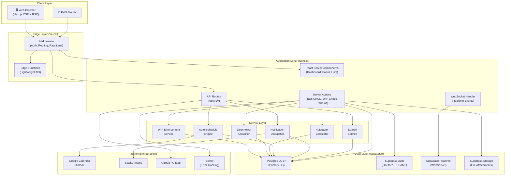
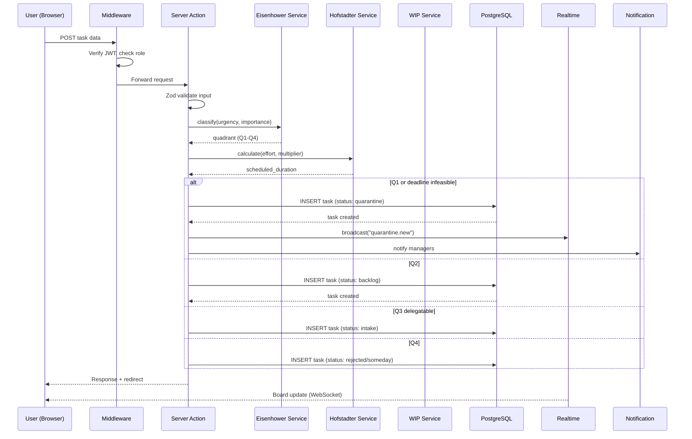
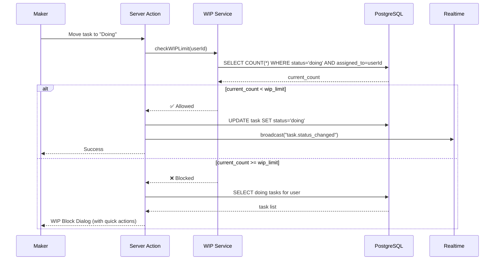
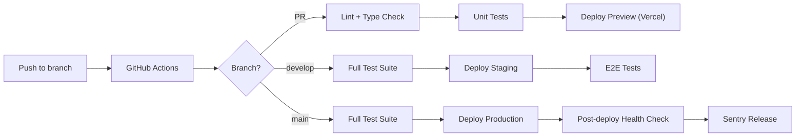

# KIẾN TRÚC HỆ THỐNG — FlowGuard

**Phiên bản:** 1.0  
**Ngày:** 2026-03-19  
**Tham chiếu:** [PRD.md](../PRD.md) §12.0

---

## 1. Tổng quan Kiến trúc

FlowGuard sử dụng kiến trúc **Fullstack Monolith** với Next.js, kết hợp Supabase làm Backend-as-a-Service. Đây là lựa chọn tối ưu cho giai đoạn MVP → Scale (Phase 1-3).

### 1.1 Triết lý Kiến trúc

| Nguyên tắc | Mô tả |
|-------------|--------|
| **Fullstack Monolith** | Frontend + Backend cùng 1 repo Next.js — giảm overhead deploy, dễ maintain |
| **Server-first** | Ưu tiên React Server Components (RSC) và Server Actions — giảm bundle size |
| **Edge-ready** | Middleware + Edge Functions cho auth & routing — latency thấp globally |
| **Type-safe** | TypeScript end-to-end, Zod validation, generated types từ DB schema |
| **Realtime-native** | WebSocket/Supabase Realtime cho WIP updates, board sync, notifications |

### 1.2 High-Level Architecture



---

## 2. Tech Stack Chi tiết

### 2.1 Frontend

| Thành phần | Công nghệ | Phiên bản | Vai trò |
|------------|----------|-----------|---------|
| Framework | Next.js (App Router) | 16.1.x | SSR, RSC, Turbopack, Routing |
| Runtime | React | 19.2.x | Server Components, Actions, `use()` |
| Language | TypeScript | 5.9 | Type safety, Decorator Metadata |
| UI Library | Shadcn CLI v4 + Radix/Base UI | CLI 4.0 | Accessible, monochrome-friendly, portable presets |
| State (Client) | Zustand | 5.0.x | Local UI state (Focus Mode, sidebar) |
| State (Server) | TanStack Query (React Query) | 5.90.x | Server state cache, mutation |
| Forms | React Hook Form + Zod | Latest | Validation, Intake Form |
| Drag & Drop | @dnd-kit/core | Latest | Kanban board |
| Charts | Recharts | Latest | Burndown, Heatmap |
| Icons | Lucide React | Latest | Consistent icon set |
| Date/Time | date-fns | Latest | Date manipulation, i18n |
| Markdown | react-markdown + remark | Latest | Task description rendering |

### 2.2 Backend

| Thành phần | Công nghệ | Vai trò |
|------------|----------|---------|
| API Layer | Next.js API Routes + Server Actions | REST API + form mutations |
| Validation | Zod | Request/response schema validation |
| ORM / Query | @supabase/supabase-js 2.99.x + raw SQL | Type-safe DB queries |
| Auth | Supabase Auth (Passkeys + Biometric) | JWT, OAuth 2.0, SAML, Passkeys |
| Realtime | Supabase Realtime | WebSocket broadcast |
| File Storage | Supabase Storage (v2, 14.8x faster) | Attachments (S3-compatible) |
| Email | Resend | Transactional email notifications |
| Cron Jobs | Vercel Cron | Recurring task generation, cleanup |

### 2.3 Database

| Thành phần | Công nghệ | Vai trò |
|------------|----------|---------|
| Primary DB | PostgreSQL 17.9 (Supabase) | Core data, JSONB, FTS |
| Search | pg_trgm + tsvector | Full-text + fuzzy search |
| Security | Row Level Security (RLS) | Multi-tenant data isolation |
| Connection | Supabase Pooler (PgBouncer) | Connection pooling |

### 2.4 Infrastructure

| Thành phần | Công nghệ | Vai trò |
|------------|----------|---------|
| Hosting | Vercel | Frontend + Edge + Serverless |
| Database | Supabase Cloud | Managed PostgreSQL |
| CDN | Vercel Edge Network | Static assets, global distribution |
| CI/CD | GitHub Actions | Auto test, lint, deploy |
| Monitoring | Sentry | Error tracking, performance |
| Analytics | Vercel Analytics | Web vitals, usage metrics |
| DNS | Vercel / Cloudflare | Domain management |

---

## 3. Cấu trúc Thư mục (Project Structure)

```
flowguard/
├── .github/
│   ├── workflows/
│   │   ├── ci.yml                    # Lint + Test on PR
│   │   ├── deploy-preview.yml        # Preview deploy on PR
│   │   └── deploy-production.yml     # Production deploy on main
│   └── PULL_REQUEST_TEMPLATE.md
│
├── public/
│   ├── manifest.json                 # PWA manifest
│   ├── sw.js                         # Service Worker
│   └── icons/                        # PWA icons
│
├── src/
│   ├── app/                          # Next.js App Router
│   │   ├── (auth)/                   # Auth group routes
│   │   │   ├── login/page.tsx
│   │   │   ├── register/page.tsx
│   │   │   └── layout.tsx
│   │   │
│   │   ├── (dashboard)/              # Authenticated routes
│   │   │   ├── layout.tsx            # Dashboard shell (sidebar, header)
│   │   │   ├── page.tsx              # Dashboard home
│   │   │   ├── board/page.tsx        # Kanban Board (Manager View)
│   │   │   ├── focus/page.tsx        # Focus View (Maker View)
│   │   │   ├── quarantine/page.tsx   # Quarantine Zone
│   │   │   ├── cycles/
│   │   │   │   ├── page.tsx          # Cycle Dashboard
│   │   │   │   └── [id]/page.tsx     # Cycle detail
│   │   │   ├── projects/
│   │   │   │   ├── page.tsx
│   │   │   │   └── [id]/page.tsx
│   │   │   ├── tasks/
│   │   │   │   ├── page.tsx
│   │   │   │   └── [id]/page.tsx
│   │   │   ├── analytics/page.tsx    # Manager/Executive dashboards
│   │   │   └── settings/
│   │   │       ├── page.tsx
│   │   │       ├── team/page.tsx
│   │   │       └── wip/page.tsx      # WIP Rules configuration
│   │   │
│   │   ├── api/                      # API Routes
│   │   │   └── v1/
│   │   │       ├── tasks/route.ts
│   │   │       ├── quick-strike/route.ts
│   │   │       ├── search/route.ts
│   │   │       ├── webhooks/route.ts
│   │   │       └── cron/
│   │   │           ├── recurring-tasks/route.ts
│   │   │           └── on-hold-escalation/route.ts
│   │   │
│   │   ├── layout.tsx                # Root layout
│   │   ├── not-found.tsx
│   │   └── error.tsx
│   │
│   ├── components/                   # React Components
│   │   ├── ui/                       # Shadcn/UI base components
│   │   │   ├── button.tsx
│   │   │   ├── dialog.tsx
│   │   │   ├── card.tsx
│   │   │   └── ...
│   │   ├── layout/                   # Layout components
│   │   │   ├── sidebar.tsx
│   │   │   ├── header.tsx
│   │   │   └── mobile-nav.tsx
│   │   ├── board/                    # Kanban board components
│   │   │   ├── board-view.tsx
│   │   │   ├── board-column.tsx
│   │   │   └── task-card.tsx
│   │   ├── focus/                    # Focus Mode components
│   │   │   ├── focus-view.tsx
│   │   │   ├── pomodoro-timer.tsx
│   │   │   └── exit-dialog.tsx
│   │   ├── task/                     # Task-related components
│   │   │   ├── task-form.tsx
│   │   │   ├── task-detail.tsx
│   │   │   ├── task-status-badge.tsx
│   │   │   ├── eisenhower-badge.tsx
│   │   │   └── wip-block-dialog.tsx
│   │   ├── quarantine/              # Quarantine components
│   │   │   ├── quarantine-list.tsx
│   │   │   └── trade-off-dialog.tsx
│   │   ├── cycle/                   # Cycle components
│   │   │   ├── cycle-dashboard.tsx
│   │   │   ├── milestone-progress.tsx
│   │   │   └── burndown-chart.tsx
│   │   ├── quick-strike/            # Quick Strike
│   │   │   └── quick-strike-bar.tsx
│   │   ├── comments/                # Comments & Activity
│   │   │   ├── comment-thread.tsx
│   │   │   └── activity-feed.tsx
│   │   └── analytics/               # Dashboard charts
│   │       ├── wip-heatmap.tsx
│   │       └── throughput-chart.tsx
│   │
│   ├── lib/                         # Core utilities & services
│   │   ├── supabase/
│   │   │   ├── client.ts            # Browser Supabase client
│   │   │   ├── server.ts            # Server Supabase client
│   │   │   ├── admin.ts             # Service role client
│   │   │   └── middleware.ts        # Auth middleware helper
│   │   ├── services/                # Business logic services
│   │   │   ├── wip.service.ts       # WIP enforcement logic
│   │   │   ├── eisenhower.service.ts # Eisenhower classification
│   │   │   ├── hofstadter.service.ts # Hofstadter multiplier calc
│   │   │   ├── task.service.ts      # Task CRUD + status transitions
│   │   │   ├── schedule.service.ts  # Auto-scheduling engine
│   │   │   ├── notification.service.ts
│   │   │   ├── search.service.ts
│   │   │   └── cycle.service.ts
│   │   ├── actions/                 # Server Actions (Next.js)
│   │   │   ├── task.actions.ts
│   │   │   ├── trade-off.actions.ts
│   │   │   ├── cycle.actions.ts
│   │   │   └── settings.actions.ts
│   │   ├── validators/              # Zod schemas
│   │   │   ├── task.schema.ts
│   │   │   ├── cycle.schema.ts
│   │   │   └── user.schema.ts
│   │   ├── constants/
│   │   │   ├── task-status.ts       # Status enum & transitions
│   │   │   ├── error-codes.ts       # Error code constants
│   │   │   └── wip-defaults.ts
│   │   ├── hooks/                   # Custom React hooks
│   │   │   ├── use-wip-status.ts
│   │   │   ├── use-focus-mode.ts
│   │   │   ├── use-realtime-board.ts
│   │   │   └── use-keyboard-shortcuts.ts
│   │   ├── stores/                  # Zustand stores
│   │   │   ├── focus-store.ts
│   │   │   ├── sidebar-store.ts
│   │   │   └── quick-strike-store.ts
│   │   └── utils/
│   │       ├── date.ts
│   │       ├── format.ts
│   │       └── cn.ts                # className helper
│   │
│   ├── types/                       # TypeScript type definitions
│   │   ├── database.types.ts        # Generated from Supabase
│   │   ├── task.types.ts
│   │   ├── user.types.ts
│   │   └── api.types.ts
│   │
│   └── styles/
│       └── globals.css              # Global styles + CSS variables
│
├── supabase/
│   ├── migrations/                  # SQL migration files
│   │   ├── 001_initial_schema.sql
│   │   ├── 002_rls_policies.sql
│   │   ├── 003_functions_triggers.sql
│   │   └── 004_indexes.sql
│   ├── seed.sql                     # Dev seed data
│   └── config.toml                  # Supabase local config
│
├── docs/                            # Technical documentation
│   ├── 01_SYSTEM_ARCHITECTURE.md
│   ├── 02_DATABASE_SCHEMA.md
│   ├── 03_API_SPEC.md
│   ├── 04_SECURITY_MODEL.md
│   ├── 05_ENGINEERING_GUIDELINES.md
│   ├── 06_TASK_WORKFLOW.md
│   ├── 07_ERROR_CODE_CATALOG.md
│   ├── ui-guideline.md
│   └── components/
│
├── tests/                           # Test files
│   ├── unit/
│   ├── integration/
│   └── e2e/
│
├── .env.local.example               # Env template
├── .eslintrc.json
├── .prettierrc
├── next.config.ts
├── tailwind.config.ts               # Nếu dùng Tailwind via Shadcn
├── tsconfig.json
├── package.json
└── README.md
```

---

## 4. Data Flow — Luồng dữ liệu chính

### 4.1 Task Creation Flow



### 4.2 WIP Enforcement Flow



---

## 5. Deployment Architecture

### 5.1 Environments

| Environment | URL | Branch | Database | Mục đích |
|-------------|-----|--------|----------|----------|
| Local Dev | `localhost:3000` | `*` | Supabase local | Development |
| Preview | `*.vercel.app` | PR branches | Supabase staging | PR review |
| Staging | `staging.flowguard.app` | `develop` | Supabase staging | QA testing |
| Production | `app.flowguard.app` | `main` | Supabase production | Live users |

### 5.2 CI/CD Pipeline



---

## 6. Realtime Architecture

### 6.1 WebSocket Events

FlowGuard sử dụng Supabase Realtime cho các events cần cập nhật tức thì:

| Channel | Event | Data | Subscribers |
|---------|-------|------|-------------|
| `board:{projectId}` | `task.status_changed` | task_id, from, to | Board viewers |
| `wip:{teamId}` | `wip.violation` | user_id, count, limit | Managers |
| `quarantine:{orgId}` | `quarantine.new` | task_id, reason | Managers |
| `focus:{userId}` | `focus.started/ended` | task_id | Team members |
| `notifications:{userId}` | `notification.new` | notification object | Individual user |

### 6.2 Subscription Strategy

```typescript
// Client-side subscription pattern
const channel = supabase
  .channel(`board:${projectId}`)
  .on('postgres_changes', 
    { event: 'UPDATE', schema: 'public', table: 'tasks', filter: `project_id=eq.${projectId}` },
    (payload) => {
      // Optimistic UI update via React Query invalidation
      queryClient.invalidateQueries(['tasks', projectId])
    }
  )
  .subscribe()
```

---

## 7. Caching Strategy (Tổng quan)

| Layer | Mechanism | TTL | Invalidation |
|-------|-----------|-----|-------------|
| Browser | React Query cache | 5 min (stale) | Manual invalidate on mutation |
| Edge | Vercel Edge Cache | 60s (ISR) | On-demand revalidation |
| Database | PostgreSQL query cache | Auto | Schema change |
| Static | Vercel CDN | Immutable | Build hash |

---

## 8. Giới hạn & Quyết định Kiến trúc

### 8.1 Architecture Decision Records (ADR)

| # | Quyết định | Lý do | Trade-off |
|---|-----------|-------|-----------|
| ADR-001 | Next.js Monolith thay vì Microservices | Tốc độ dev nhanh, team nhỏ, giảm infra complexity | Giới hạn scale horizontal ở Phase 1-2 |
| ADR-002 | Supabase thay vì custom backend | Auth + DB + Realtime + Storage out-of-the-box | Vendor lock-in, nhưng PostgreSQL portable |
| ADR-003 | RSC + Server Actions thay vì REST-first | Giảm client bundle, type-safe, co-locate logic | REST API vẫn cần cho third-party integration |
| ADR-004 | PostgreSQL FTS thay vì Elasticsearch | Đơn giản, không cần thêm infra | Giới hạn ở scale lớn, nhưng đủ cho 10K users |
| ADR-005 | PWA thay vì Native Mobile | 1 codebase, nhanh deploy, đủ cho task management | Không có push notification native (dùng Web Push) |
| ADR-006 | Zustand thay vì Redux | Lightweight, ít boilerplate, đủ cho UI state | Ít tooling (DevTools kém hơn Redux) |

---

> **Tài liệu liên quan:**
> - [PRD.md](../PRD.md) — Yêu cầu sản phẩm
> - [02_DATABASE_SCHEMA.md](./02_DATABASE_SCHEMA.md) — Chi tiết database
> - [03_API_SPEC.md](./03_API_SPEC.md) — API specification
> - [04_SECURITY_MODEL.md](./04_SECURITY_MODEL.md) — Mô hình bảo mật
