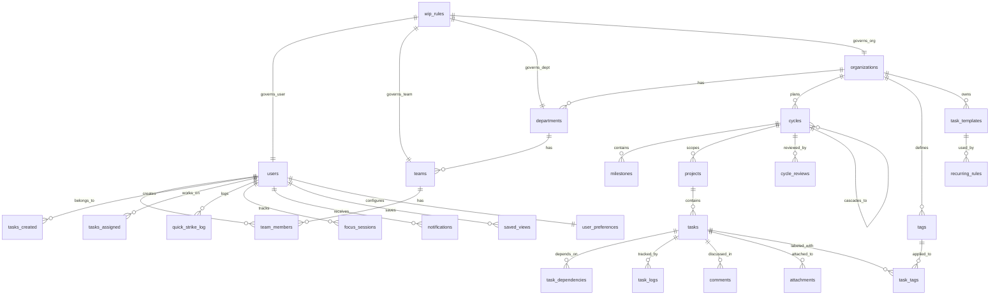

# DATABASE SCHEMA — Tulie Workspace

**Phiên bản:** 1.0  
**Ngày:** 2026-03-19  
**Database:** PostgreSQL 17.9 (Supabase)  
**Tham chiếu:** [PRD.md](../PRD.md) §7

---

## 1. Entity Relationship Diagram



---

## 2. SQL DDL — Migration Files

### 2.1 Migration 001: Core Schema

```sql
-- Migration: 001_initial_schema.sql
-- Description: Core tables for Tulie Workspace
-- Date: 2026-03-19

-- ============================================
-- ENUM TYPES
-- ============================================

CREATE TYPE user_role AS ENUM ('admin', 'manager', 'maker', 'observer');
CREATE TYPE cycle_status AS ENUM ('planning', 'active', 'review', 'closed');
CREATE TYPE project_status AS ENUM ('planning', 'active', 'on_hold', 'completed', 'archived');
CREATE TYPE project_priority AS ENUM ('critical', 'high', 'medium', 'low');
CREATE TYPE task_status AS ENUM (
    'intake', 'backlog', 'quarantine', 'ready', 
    'doing', 'on_hold', 'in_review', 'done', 'rejected'
);
CREATE TYPE eisenhower_quadrant AS ENUM ('Q1', 'Q2', 'Q3', 'Q4');
CREATE TYPE dependency_type AS ENUM ('blocks', 'relates_to');
CREATE TYPE trade_off_decision AS ENUM (
    'swap', 'add_resource', 'reduce_scope', 'extend_deadline', 'reject'
);
CREATE TYPE comment_type AS ENUM ('general', 'decision', 'blocker', 'handoff');
CREATE TYPE notification_severity AS ENUM ('critical', 'important', 'info', 'silent');
CREATE TYPE notification_channel AS ENUM ('push', 'in_app', 'email', 'badge');
CREATE TYPE recurrence_type AS ENUM ('daily', 'weekly', 'biweekly', 'monthly', 'custom');
CREATE TYPE theme_preference AS ENUM ('light', 'dark', 'auto');
CREATE TYPE wip_scope AS ENUM ('user', 'team', 'department', 'organization');

-- ============================================
-- ORGANIZATIONS & TEAMS
-- ============================================

CREATE TABLE organizations (
    id UUID PRIMARY KEY DEFAULT gen_random_uuid(),
    name VARCHAR(255) NOT NULL,
    slug VARCHAR(100) UNIQUE NOT NULL,
    logo_url VARCHAR(1000),
    settings JSONB DEFAULT '{}',
    created_at TIMESTAMPTZ DEFAULT NOW(),
    updated_at TIMESTAMPTZ DEFAULT NOW()
);

CREATE TABLE departments (
    id UUID PRIMARY KEY DEFAULT gen_random_uuid(),
    organization_id UUID NOT NULL REFERENCES organizations(id) ON DELETE CASCADE,
    name VARCHAR(255) NOT NULL,
    head_user_id UUID,  -- FK added after users table
    created_at TIMESTAMPTZ DEFAULT NOW(),
    updated_at TIMESTAMPTZ DEFAULT NOW(),
    UNIQUE(organization_id, name)
);

CREATE TABLE teams (
    id UUID PRIMARY KEY DEFAULT gen_random_uuid(),
    department_id UUID NOT NULL REFERENCES departments(id) ON DELETE CASCADE,
    name VARCHAR(255) NOT NULL,
    lead_user_id UUID,  -- FK added after users table
    created_at TIMESTAMPTZ DEFAULT NOW(),
    updated_at TIMESTAMPTZ DEFAULT NOW(),
    UNIQUE(department_id, name)
);

-- ============================================
-- USERS
-- ============================================

CREATE TABLE users (
    id UUID PRIMARY KEY REFERENCES auth.users(id) ON DELETE CASCADE,
    email VARCHAR(255) UNIQUE NOT NULL,
    full_name VARCHAR(255) NOT NULL,
    avatar_url VARCHAR(1000),
    role_type user_role NOT NULL DEFAULT 'maker',
    organization_id UUID REFERENCES organizations(id) ON DELETE SET NULL,
    department_id UUID REFERENCES departments(id) ON DELETE SET NULL,
    team_id UUID REFERENCES teams(id) ON DELETE SET NULL,
    maker_block_min_hours DECIMAL(3,1) DEFAULT 2.0,
    personal_wip_limit INT DEFAULT 2 CHECK (personal_wip_limit BETWEEN 1 AND 5),
    hofstadter_multiplier DECIMAL(3,2) DEFAULT 1.30 CHECK (hofstadter_multiplier BETWEEN 1.00 AND 3.00),
    is_active BOOLEAN DEFAULT true,
    last_seen_at TIMESTAMPTZ,
    created_at TIMESTAMPTZ DEFAULT NOW(),
    updated_at TIMESTAMPTZ DEFAULT NOW()
);

-- Add FKs that reference users
ALTER TABLE departments ADD CONSTRAINT fk_dept_head 
    FOREIGN KEY (head_user_id) REFERENCES users(id) ON DELETE SET NULL;
ALTER TABLE teams ADD CONSTRAINT fk_team_lead 
    FOREIGN KEY (lead_user_id) REFERENCES users(id) ON DELETE SET NULL;

CREATE TABLE team_members (
    team_id UUID REFERENCES teams(id) ON DELETE CASCADE,
    user_id UUID REFERENCES users(id) ON DELETE CASCADE,
    joined_at TIMESTAMPTZ DEFAULT NOW(),
    PRIMARY KEY (team_id, user_id)
);

-- ============================================
-- CYCLES & MILESTONES
-- ============================================

CREATE TABLE cycles (
    id UUID PRIMARY KEY DEFAULT gen_random_uuid(),
    name VARCHAR(255) NOT NULL,
    organization_id UUID NOT NULL REFERENCES organizations(id) ON DELETE CASCADE,
    parent_cycle_id UUID REFERENCES cycles(id) ON DELETE SET NULL,
    start_date DATE NOT NULL,
    end_date DATE NOT NULL,
    buffer_week_start DATE NOT NULL,
    status cycle_status NOT NULL DEFAULT 'planning',
    goals JSONB DEFAULT '[]',
    created_by UUID NOT NULL REFERENCES users(id),
    created_at TIMESTAMPTZ DEFAULT NOW(),
    updated_at TIMESTAMPTZ DEFAULT NOW(),
    
    CONSTRAINT chk_cycle_dates CHECK (end_date > start_date),
    CONSTRAINT chk_buffer_date CHECK (buffer_week_start >= end_date)
);

CREATE TABLE milestones (
    id UUID PRIMARY KEY DEFAULT gen_random_uuid(),
    cycle_id UUID NOT NULL REFERENCES cycles(id) ON DELETE CASCADE,
    name VARCHAR(255) NOT NULL,
    description TEXT,
    target_date DATE NOT NULL,
    completion_rate DECIMAL(5,2) DEFAULT 0.00,
    sort_order INT NOT NULL DEFAULT 0,
    created_at TIMESTAMPTZ DEFAULT NOW(),
    updated_at TIMESTAMPTZ DEFAULT NOW()
);

-- ============================================
-- PROJECTS
-- ============================================

CREATE TABLE projects (
    id UUID PRIMARY KEY DEFAULT gen_random_uuid(),
    name VARCHAR(255) NOT NULL,
    description TEXT,
    cycle_id UUID NOT NULL REFERENCES cycles(id) ON DELETE RESTRICT,
    owner_id UUID NOT NULL REFERENCES users(id),
    organization_id UUID NOT NULL REFERENCES organizations(id) ON DELETE CASCADE,
    status project_status NOT NULL DEFAULT 'planning',
    priority project_priority NOT NULL DEFAULT 'medium',
    created_at TIMESTAMPTZ DEFAULT NOW(),
    updated_at TIMESTAMPTZ DEFAULT NOW()
);

-- ============================================
-- TASKS (Core entity)
-- ============================================

CREATE TABLE tasks (
    id UUID PRIMARY KEY DEFAULT gen_random_uuid(),
    title VARCHAR(500) NOT NULL CHECK (char_length(title) >= 10),
    description TEXT,
    project_id UUID NOT NULL REFERENCES projects(id) ON DELETE CASCADE,
    created_by UUID NOT NULL REFERENCES users(id),
    assigned_to UUID REFERENCES users(id) ON DELETE SET NULL,
    status task_status NOT NULL DEFAULT 'intake',
    eisenhower_quadrant eisenhower_quadrant,
    estimated_effort_hours DECIMAL(5,2) NOT NULL CHECK (estimated_effort_hours > 0),
    hofstadter_multiplier DECIMAL(3,2) NOT NULL DEFAULT 1.30,
    scheduled_duration_hours DECIMAL(5,2) GENERATED ALWAYS AS (
        estimated_effort_hours * hofstadter_multiplier
    ) STORED,
    requested_deadline TIMESTAMPTZ,
    scheduled_start TIMESTAMPTZ,
    scheduled_end TIMESTAMPTZ,
    actual_start TIMESTAMPTZ,
    actual_end TIMESTAMPTZ,
    priority INT DEFAULT 0,
    cycle_id UUID REFERENCES cycles(id),
    milestone_id UUID REFERENCES milestones(id) ON DELETE SET NULL,
    carried_over_from UUID REFERENCES cycles(id),
    carried_over_count INT DEFAULT 0,
    is_recurring_instance BOOLEAN DEFAULT false,
    recurring_rule_id UUID,  -- FK added after recurring_rules table
    created_at TIMESTAMPTZ DEFAULT NOW(),
    updated_at TIMESTAMPTZ DEFAULT NOW()
);

-- ============================================
-- TASK DEPENDENCIES
-- ============================================

CREATE TABLE task_dependencies (
    id UUID PRIMARY KEY DEFAULT gen_random_uuid(),
    task_id UUID NOT NULL REFERENCES tasks(id) ON DELETE CASCADE,
    depends_on_task_id UUID NOT NULL REFERENCES tasks(id) ON DELETE CASCADE,
    dependency_type dependency_type NOT NULL DEFAULT 'blocks',
    created_at TIMESTAMPTZ DEFAULT NOW(),
    
    CONSTRAINT chk_no_self_dependency CHECK (task_id != depends_on_task_id),
    UNIQUE(task_id, depends_on_task_id)
);

-- ============================================
-- WIP RULES
-- ============================================

CREATE TABLE wip_rules (
    id UUID PRIMARY KEY DEFAULT gen_random_uuid(),
    scope_type wip_scope NOT NULL,
    scope_id UUID NOT NULL,
    max_doing INT NOT NULL DEFAULT 2 CHECK (max_doing >= 1),
    max_projects INT CHECK (max_projects >= 1),
    can_override BOOLEAN DEFAULT true,
    created_at TIMESTAMPTZ DEFAULT NOW(),
    updated_at TIMESTAMPTZ DEFAULT NOW(),
    
    UNIQUE(scope_type, scope_id)
);

-- ============================================
-- TRADE-OFF LOGS
-- ============================================

CREATE TABLE trade_off_logs (
    id UUID PRIMARY KEY DEFAULT gen_random_uuid(),
    task_id UUID NOT NULL REFERENCES tasks(id) ON DELETE CASCADE,
    decided_by UUID NOT NULL REFERENCES users(id),
    decision trade_off_decision NOT NULL,
    affected_task_id UUID REFERENCES tasks(id) ON DELETE SET NULL,
    reason TEXT NOT NULL CHECK (char_length(reason) >= 20),
    decided_at TIMESTAMPTZ DEFAULT NOW()
);

-- ============================================
-- QUICK STRIKE LOG
-- ============================================

CREATE TABLE quick_strike_log (
    id UUID PRIMARY KEY DEFAULT gen_random_uuid(),
    user_id UUID NOT NULL REFERENCES users(id) ON DELETE CASCADE,
    description VARCHAR(200) NOT NULL,
    completed_at TIMESTAMPTZ DEFAULT NOW()
);

-- ============================================
-- TASK LOGS (Audit Trail)
-- ============================================

CREATE TABLE task_logs (
    id UUID PRIMARY KEY DEFAULT gen_random_uuid(),
    task_id UUID NOT NULL REFERENCES tasks(id) ON DELETE CASCADE,
    user_id UUID NOT NULL REFERENCES users(id),
    action VARCHAR(50) NOT NULL,
    from_value VARCHAR(255),
    to_value VARCHAR(255),
    note TEXT,
    metadata JSONB DEFAULT '{}',
    created_at TIMESTAMPTZ DEFAULT NOW()
);

-- ============================================
-- COMMENTS
-- ============================================

CREATE TABLE comments (
    id UUID PRIMARY KEY DEFAULT gen_random_uuid(),
    task_id UUID NOT NULL REFERENCES tasks(id) ON DELETE CASCADE,
    user_id UUID NOT NULL REFERENCES users(id),
    content TEXT NOT NULL,
    comment_type comment_type NOT NULL DEFAULT 'general',
    is_pinned BOOLEAN DEFAULT false,
    parent_comment_id UUID REFERENCES comments(id) ON DELETE CASCADE,
    created_at TIMESTAMPTZ DEFAULT NOW(),
    updated_at TIMESTAMPTZ DEFAULT NOW()
);

-- ============================================
-- ATTACHMENTS
-- ============================================

CREATE TABLE attachments (
    id UUID PRIMARY KEY DEFAULT gen_random_uuid(),
    task_id UUID NOT NULL REFERENCES tasks(id) ON DELETE CASCADE,
    uploaded_by UUID NOT NULL REFERENCES users(id),
    file_name VARCHAR(500) NOT NULL,
    file_path VARCHAR(1000) NOT NULL,
    file_size_bytes BIGINT NOT NULL CHECK (file_size_bytes <= 52428800), -- 50MB max
    mime_type VARCHAR(100) NOT NULL,
    version INT NOT NULL DEFAULT 1,
    created_at TIMESTAMPTZ DEFAULT NOW()
);

-- ============================================
-- TAGS
-- ============================================

CREATE TABLE tags (
    id UUID PRIMARY KEY DEFAULT gen_random_uuid(),
    name VARCHAR(100) NOT NULL,
    color VARCHAR(7) NOT NULL DEFAULT '#6B7280',
    organization_id UUID NOT NULL REFERENCES organizations(id) ON DELETE CASCADE,
    created_at TIMESTAMPTZ DEFAULT NOW(),
    
    UNIQUE(organization_id, name)
);

CREATE TABLE task_tags (
    task_id UUID REFERENCES tasks(id) ON DELETE CASCADE,
    tag_id UUID REFERENCES tags(id) ON DELETE CASCADE,
    PRIMARY KEY (task_id, tag_id)
);

-- ============================================
-- TEMPLATES & RECURRING
-- ============================================

CREATE TABLE task_templates (
    id UUID PRIMARY KEY DEFAULT gen_random_uuid(),
    name VARCHAR(255) NOT NULL,
    category VARCHAR(100),
    title_prefix VARCHAR(100),
    description_template TEXT,
    default_effort_hours DECIMAL(5,2),
    default_labels JSONB DEFAULT '[]',
    checklist_template JSONB DEFAULT '[]',
    organization_id UUID NOT NULL REFERENCES organizations(id) ON DELETE CASCADE,
    created_by UUID NOT NULL REFERENCES users(id),
    created_at TIMESTAMPTZ DEFAULT NOW(),
    updated_at TIMESTAMPTZ DEFAULT NOW()
);

CREATE TABLE recurring_rules (
    id UUID PRIMARY KEY DEFAULT gen_random_uuid(),
    template_id UUID REFERENCES task_templates(id) ON DELETE SET NULL,
    title_pattern VARCHAR(500) NOT NULL,
    recurrence_type recurrence_type NOT NULL,
    cron_expression VARCHAR(100),
    assigned_to UUID REFERENCES users(id) ON DELETE SET NULL,
    project_id UUID REFERENCES projects(id) ON DELETE CASCADE,
    is_active BOOLEAN DEFAULT true,
    last_generated_at TIMESTAMPTZ,
    created_by UUID NOT NULL REFERENCES users(id),
    created_at TIMESTAMPTZ DEFAULT NOW(),
    updated_at TIMESTAMPTZ DEFAULT NOW()
);

ALTER TABLE tasks ADD CONSTRAINT fk_recurring_rule 
    FOREIGN KEY (recurring_rule_id) REFERENCES recurring_rules(id) ON DELETE SET NULL;

-- ============================================
-- NOTIFICATIONS
-- ============================================

CREATE TABLE notifications (
    id UUID PRIMARY KEY DEFAULT gen_random_uuid(),
    user_id UUID NOT NULL REFERENCES users(id) ON DELETE CASCADE,
    type notification_severity NOT NULL DEFAULT 'info',
    title VARCHAR(255) NOT NULL,
    content TEXT,
    related_task_id UUID REFERENCES tasks(id) ON DELETE CASCADE,
    channel notification_channel NOT NULL DEFAULT 'in_app',
    is_read BOOLEAN DEFAULT false,
    created_at TIMESTAMPTZ DEFAULT NOW()
);

-- ============================================
-- FOCUS SESSIONS
-- ============================================

CREATE TABLE focus_sessions (
    id UUID PRIMARY KEY DEFAULT gen_random_uuid(),
    user_id UUID NOT NULL REFERENCES users(id) ON DELETE CASCADE,
    task_id UUID NOT NULL REFERENCES tasks(id) ON DELETE CASCADE,
    started_at TIMESTAMPTZ NOT NULL DEFAULT NOW(),
    ended_at TIMESTAMPTZ,
    duration_minutes INT GENERATED ALWAYS AS (
        CASE WHEN ended_at IS NOT NULL 
            THEN EXTRACT(EPOCH FROM (ended_at - started_at)) / 60
            ELSE NULL 
        END
    ) STORED,
    exit_note TEXT,
    pomodoro_count INT DEFAULT 0,
    created_at TIMESTAMPTZ DEFAULT NOW()
);

-- ============================================
-- CYCLE REVIEWS
-- ============================================

CREATE TABLE cycle_reviews (
    id UUID PRIMARY KEY DEFAULT gen_random_uuid(),
    cycle_id UUID NOT NULL REFERENCES cycles(id) ON DELETE CASCADE,
    reviewed_by UUID NOT NULL REFERENCES users(id),
    completion_rate DECIMAL(5,2) NOT NULL,
    carry_over_count INT DEFAULT 0,
    lessons_learned TEXT,
    improvement_actions JSONB DEFAULT '[]',
    reviewed_at TIMESTAMPTZ DEFAULT NOW()
);

-- ============================================
-- USER PREFERENCES
-- ============================================

CREATE TABLE user_preferences (
    user_id UUID PRIMARY KEY REFERENCES users(id) ON DELETE CASCADE,
    theme theme_preference DEFAULT 'auto',
    language VARCHAR(5) DEFAULT 'vi',
    notification_channels JSONB DEFAULT '{"critical": ["push","in_app","email"], "important": ["in_app","email"], "info": ["in_app"], "silent": ["badge"]}',
    default_view VARCHAR(50) DEFAULT 'board',
    timezone VARCHAR(50) DEFAULT 'Asia/Ho_Chi_Minh',
    focus_mode_auto_dnd BOOLEAN DEFAULT true,
    updated_at TIMESTAMPTZ DEFAULT NOW()
);

-- ============================================
-- SAVED VIEWS
-- ============================================

CREATE TABLE saved_views (
    id UUID PRIMARY KEY DEFAULT gen_random_uuid(),
    user_id UUID NOT NULL REFERENCES users(id) ON DELETE CASCADE,
    name VARCHAR(255) NOT NULL,
    filters JSONB NOT NULL DEFAULT '{}',
    is_default BOOLEAN DEFAULT false,
    is_shared BOOLEAN DEFAULT false,
    team_id UUID REFERENCES teams(id) ON DELETE CASCADE,
    created_at TIMESTAMPTZ DEFAULT NOW(),
    updated_at TIMESTAMPTZ DEFAULT NOW()
);
```

### 2.2 Migration 002: Indexes

```sql
-- Migration: 002_indexes.sql
-- Description: Performance indexes

-- Tasks: WIP query (most critical)
CREATE INDEX idx_tasks_assignee_status ON tasks(assigned_to, status);
CREATE INDEX idx_tasks_cycle_status ON tasks(cycle_id, status);
CREATE INDEX idx_tasks_project_status ON tasks(project_id, status);
CREATE INDEX idx_tasks_eisenhower ON tasks(eisenhower_quadrant, status);
CREATE INDEX idx_tasks_milestone ON tasks(milestone_id) WHERE milestone_id IS NOT NULL;
CREATE INDEX idx_tasks_carried_over ON tasks(carried_over_count) WHERE carried_over_count > 0;
CREATE INDEX idx_tasks_status ON tasks(status);
CREATE INDEX idx_tasks_priority ON tasks(priority DESC);

-- Full-text search
ALTER TABLE tasks ADD COLUMN search_vector tsvector 
    GENERATED ALWAYS AS (
        setweight(to_tsvector('simple', coalesce(title, '')), 'A') ||
        setweight(to_tsvector('simple', coalesce(description, '')), 'B')
    ) STORED;
CREATE INDEX idx_tasks_fulltext ON tasks USING GIN(search_vector);

-- Trigram for fuzzy search
CREATE EXTENSION IF NOT EXISTS pg_trgm;
CREATE INDEX idx_tasks_title_trgm ON tasks USING GIN(title gin_trgm_ops);

-- Comments
CREATE INDEX idx_comments_task ON comments(task_id, created_at);
CREATE INDEX idx_comments_pinned ON comments(task_id) WHERE is_pinned = true;

-- Notifications
CREATE INDEX idx_notifications_user ON notifications(user_id, is_read, created_at DESC);
CREATE INDEX idx_notifications_unread ON notifications(user_id, created_at DESC) WHERE is_read = false;

-- Focus sessions
CREATE INDEX idx_focus_sessions_user ON focus_sessions(user_id, started_at DESC);
CREATE INDEX idx_focus_sessions_active ON focus_sessions(user_id) WHERE ended_at IS NULL;

-- Task logs
CREATE INDEX idx_task_logs_task ON task_logs(task_id, created_at DESC);
CREATE INDEX idx_task_logs_action ON task_logs(action, created_at DESC);

-- Trade-off logs
CREATE INDEX idx_trade_off_logs_task ON trade_off_logs(task_id, decided_at DESC);

-- Quick strike
CREATE INDEX idx_quick_strike_user ON quick_strike_log(user_id, completed_at DESC);

-- Attachments
CREATE INDEX idx_attachments_task ON attachments(task_id, version DESC);

-- Cycles
CREATE INDEX idx_cycles_org_status ON cycles(organization_id, status);
CREATE INDEX idx_cycles_active ON cycles(organization_id) WHERE status = 'active';

-- Projects
CREATE INDEX idx_projects_cycle ON projects(cycle_id, status);
CREATE INDEX idx_projects_owner ON projects(owner_id);
```

### 2.3 Migration 003: Functions & Triggers

```sql
-- Migration: 003_functions_triggers.sql
-- Description: Database functions and triggers

-- ============================================
-- AUTO UPDATE updated_at
-- ============================================

CREATE OR REPLACE FUNCTION update_updated_at()
RETURNS TRIGGER AS $$
BEGIN
    NEW.updated_at = NOW();
    RETURN NEW;
END;
$$ LANGUAGE plpgsql;

-- Apply to all tables with updated_at
DO $$ 
DECLARE 
    t TEXT;
BEGIN
    FOR t IN 
        SELECT table_name FROM information_schema.columns 
        WHERE column_name = 'updated_at' 
        AND table_schema = 'public'
    LOOP
        EXECUTE format(
            'CREATE TRIGGER trg_%s_updated_at 
             BEFORE UPDATE ON %I 
             FOR EACH ROW EXECUTE FUNCTION update_updated_at()',
            t, t
        );
    END LOOP;
END $$;

-- ============================================
-- WIP CHECK FUNCTION
-- ============================================

CREATE OR REPLACE FUNCTION check_wip_limit(p_user_id UUID)
RETURNS TABLE(
    current_doing INT,
    wip_limit INT,
    is_within_limit BOOLEAN,
    doing_tasks JSONB
) AS $$
DECLARE
    v_current INT;
    v_limit INT;
    v_tasks JSONB;
BEGIN
    -- Get current doing count
    SELECT COUNT(*) INTO v_current
    FROM tasks 
    WHERE assigned_to = p_user_id AND status = 'doing';
    
    -- Get WIP limit (user personal > wip_rules > default 2)
    SELECT COALESCE(u.personal_wip_limit, wr.max_doing, 2)
    INTO v_limit
    FROM users u
    LEFT JOIN wip_rules wr ON wr.scope_type = 'user' AND wr.scope_id = u.id
    WHERE u.id = p_user_id;
    
    -- Get current doing tasks
    SELECT COALESCE(jsonb_agg(jsonb_build_object(
        'id', t.id, 'title', t.title, 'actual_start', t.actual_start
    )), '[]'::jsonb)
    INTO v_tasks
    FROM tasks t 
    WHERE t.assigned_to = p_user_id AND t.status = 'doing';
    
    RETURN QUERY SELECT v_current, v_limit, v_current < v_limit, v_tasks;
END;
$$ LANGUAGE plpgsql SECURITY DEFINER;

-- ============================================
-- TASK STATUS CHANGE TRIGGER (Audit Log)
-- ============================================

CREATE OR REPLACE FUNCTION log_task_status_change()
RETURNS TRIGGER AS $$
BEGIN
    IF OLD.status IS DISTINCT FROM NEW.status THEN
        INSERT INTO task_logs (task_id, user_id, action, from_value, to_value)
        VALUES (
            NEW.id, 
            COALESCE(auth.uid(), NEW.assigned_to, NEW.created_by),
            'status_change', 
            OLD.status::TEXT, 
            NEW.status::TEXT
        );
        
        -- Auto-set actual_start when entering Doing
        IF NEW.status = 'doing' AND OLD.status != 'doing' THEN
            NEW.actual_start = NOW();
        END IF;
        
        -- Auto-set actual_end when entering Done
        IF NEW.status = 'done' AND OLD.status != 'done' THEN
            NEW.actual_end = NOW();
        END IF;
    END IF;
    
    RETURN NEW;
END;
$$ LANGUAGE plpgsql SECURITY DEFINER;

CREATE TRIGGER trg_task_status_change
    BEFORE UPDATE ON tasks
    FOR EACH ROW
    EXECUTE FUNCTION log_task_status_change();

-- ============================================
-- EISENHOWER AUTO-CLASSIFY (tính quadrant từ urgency/importance fields)
-- ============================================

CREATE OR REPLACE FUNCTION classify_eisenhower(
    p_is_urgent BOOLEAN,
    p_is_important BOOLEAN
) RETURNS eisenhower_quadrant AS $$
BEGIN
    IF p_is_urgent AND p_is_important THEN RETURN 'Q1';
    ELSIF NOT p_is_urgent AND p_is_important THEN RETURN 'Q2';
    ELSIF p_is_urgent AND NOT p_is_important THEN RETURN 'Q3';
    ELSE RETURN 'Q4';
    END IF;
END;
$$ LANGUAGE plpgsql IMMUTABLE;

-- ============================================
-- FULL-TEXT SEARCH FUNCTION
-- ============================================

CREATE OR REPLACE FUNCTION search_tasks(
    p_query TEXT,
    p_org_id UUID,
    p_limit INT DEFAULT 20,
    p_offset INT DEFAULT 0
)
RETURNS TABLE(
    id UUID,
    title VARCHAR,
    description TEXT,
    status task_status,
    assigned_to UUID,
    rank REAL
) AS $$
BEGIN
    RETURN QUERY
    SELECT 
        t.id, t.title, t.description, t.status, t.assigned_to,
        ts_rank(t.search_vector, websearch_to_tsquery('simple', p_query)) +
        similarity(t.title, p_query) AS rank
    FROM tasks t
    JOIN projects p ON t.project_id = p.id
    WHERE p.organization_id = p_org_id
    AND (
        t.search_vector @@ websearch_to_tsquery('simple', p_query)
        OR similarity(t.title, p_query) > 0.1
    )
    ORDER BY rank DESC
    LIMIT p_limit OFFSET p_offset;
END;
$$ LANGUAGE plpgsql SECURITY DEFINER;
```

### 2.4 Migration 004: RLS Policies

> Chi tiết RLS → xem [04_SECURITY_MODEL.md](./04_SECURITY_MODEL.md)

```sql
-- Migration: 004_rls_policies.sql
-- Description: Row Level Security policies

ALTER TABLE organizations ENABLE ROW LEVEL SECURITY;
ALTER TABLE departments ENABLE ROW LEVEL SECURITY;
ALTER TABLE teams ENABLE ROW LEVEL SECURITY;
ALTER TABLE users ENABLE ROW LEVEL SECURITY;
ALTER TABLE cycles ENABLE ROW LEVEL SECURITY;
ALTER TABLE projects ENABLE ROW LEVEL SECURITY;
ALTER TABLE tasks ENABLE ROW LEVEL SECURITY;
ALTER TABLE comments ENABLE ROW LEVEL SECURITY;
ALTER TABLE attachments ENABLE ROW LEVEL SECURITY;
ALTER TABLE notifications ENABLE ROW LEVEL SECURITY;
ALTER TABLE focus_sessions ENABLE ROW LEVEL SECURITY;
ALTER TABLE quick_strike_log ENABLE ROW LEVEL SECURITY;
ALTER TABLE task_logs ENABLE ROW LEVEL SECURITY;
ALTER TABLE trade_off_logs ENABLE ROW LEVEL SECURITY;
ALTER TABLE saved_views ENABLE ROW LEVEL SECURITY;
ALTER TABLE user_preferences ENABLE ROW LEVEL SECURITY;

-- ============================================
-- Helper function: Get user's org_id
-- ============================================

CREATE OR REPLACE FUNCTION get_user_org_id()
RETURNS UUID AS $$
    SELECT organization_id FROM users WHERE id = auth.uid();
$$ LANGUAGE sql SECURITY DEFINER STABLE;

-- ============================================
-- ORGANIZATIONS
-- ============================================

CREATE POLICY "Users can view their organization"
    ON organizations FOR SELECT
    USING (id = get_user_org_id());

-- ============================================
-- USERS
-- ============================================

CREATE POLICY "Users can view members of same org"
    ON users FOR SELECT
    USING (organization_id = get_user_org_id());

CREATE POLICY "Users can update their own profile"
    ON users FOR UPDATE
    USING (id = auth.uid())
    WITH CHECK (id = auth.uid());

-- ============================================
-- TASKS — Core RLS (critical for WIP enforcement)
-- ============================================

-- SELECT: users can see tasks in their organization
CREATE POLICY "View tasks in own org"
    ON tasks FOR SELECT
    USING (
        EXISTS (
            SELECT 1 FROM projects p 
            WHERE p.id = tasks.project_id 
            AND p.organization_id = get_user_org_id()
        )
    );

-- INSERT: managers and admins can create tasks for anyone, makers only for self
CREATE POLICY "Create tasks"
    ON tasks FOR INSERT
    WITH CHECK (
        created_by = auth.uid()
        AND EXISTS (
            SELECT 1 FROM projects p 
            WHERE p.id = project_id 
            AND p.organization_id = get_user_org_id()
        )
    );

-- UPDATE: assignee can update own tasks, managers can update team tasks
CREATE POLICY "Update own or managed tasks"
    ON tasks FOR UPDATE
    USING (
        assigned_to = auth.uid()
        OR created_by = auth.uid()
        OR EXISTS (
            SELECT 1 FROM users u 
            WHERE u.id = auth.uid() 
            AND u.role_type IN ('admin', 'manager')
        )
    );

-- ============================================
-- NOTIFICATIONS — Private to each user
-- ============================================

CREATE POLICY "Users see own notifications"
    ON notifications FOR SELECT
    USING (user_id = auth.uid());

CREATE POLICY "Users update own notifications"
    ON notifications FOR UPDATE
    USING (user_id = auth.uid());

-- ============================================
-- QUICK STRIKE — Private
-- ============================================

CREATE POLICY "Users manage own quick strikes"
    ON quick_strike_log FOR ALL
    USING (user_id = auth.uid());

-- ============================================
-- FOCUS SESSIONS — Private
-- ============================================

CREATE POLICY "Users manage own focus sessions"
    ON focus_sessions FOR ALL
    USING (user_id = auth.uid());

-- ============================================
-- USER PREFERENCES — Private
-- ============================================

CREATE POLICY "Users manage own preferences"
    ON user_preferences FOR ALL
    USING (user_id = auth.uid());

-- ============================================
-- SAVED VIEWS — Own + shared
-- ============================================

CREATE POLICY "Users see own or shared views"
    ON saved_views FOR SELECT
    USING (
        user_id = auth.uid()
        OR (is_shared = true AND team_id IN (
            SELECT tm.team_id FROM team_members tm WHERE tm.user_id = auth.uid()
        ))
    );

-- ============================================
-- COMMENTS, ATTACHMENTS, TASK_LOGS — Follow task access
-- ============================================

CREATE POLICY "View comments on accessible tasks"
    ON comments FOR SELECT
    USING (
        EXISTS (
            SELECT 1 FROM tasks t 
            JOIN projects p ON t.project_id = p.id 
            WHERE t.id = comments.task_id 
            AND p.organization_id = get_user_org_id()
        )
    );

CREATE POLICY "Create comments on accessible tasks"
    ON comments FOR INSERT
    WITH CHECK (
        user_id = auth.uid()
        AND EXISTS (
            SELECT 1 FROM tasks t 
            JOIN projects p ON t.project_id = p.id 
            WHERE t.id = task_id 
            AND p.organization_id = get_user_org_id()
        )
    );
```

---

## 3. Seed Data (Development)

```sql
-- seed.sql — Development data

-- Organization
INSERT INTO organizations (id, name, slug) VALUES
    ('org-001', 'Tulie Workspace Demo', 'tulie-workspace-demo');

-- Users (assume auth.users already created via Supabase Auth)
-- These reference auth.users entries
INSERT INTO users (id, email, full_name, role_type, organization_id) VALUES
    ('user-admin', 'admin@tulie-workspace.dev', 'Admin User', 'admin', 'org-001'),
    ('user-pm', 'pm@tulie-workspace.dev', 'Project Manager', 'manager', 'org-001'),
    ('user-dev1', 'dev1@tulie-workspace.dev', 'Developer One', 'maker', 'org-001'),
    ('user-dev2', 'dev2@tulie-workspace.dev', 'Developer Two', 'maker', 'org-001'),
    ('user-observer', 'observer@tulie-workspace.dev', 'Client Observer', 'observer', 'org-001');

-- WIP Rules
INSERT INTO wip_rules (scope_type, scope_id, max_doing) VALUES
    ('organization', 'org-001', 3);
```

---

## 4. Data Retention Policy

| Table | Retention | Lý do |
|-------|----------|-------|
| tasks | Vĩnh viễn | Core business data |
| task_logs | 2 năm | Audit compliance |
| quick_strike_log | 90 ngày | Statistics only |
| focus_sessions | 1 năm | Performance analytics |
| notifications | 90 ngày | Không cần lưu lâu |
| comments | Vĩnh viễn (theo task) | Context quan trọng |
| attachments (metadata) | Vĩnh viễn (theo task) | Truy xuất file |
| attachments (storage file) | 1 năm sau task Done | Tiết kiệm storage |

---

> **Tài liệu liên quan:**
> - [PRD.md](../PRD.md) §7 — Core tables overview
> - [04_SECURITY_MODEL.md](./04_SECURITY_MODEL.md) — Chi tiết RLS policies
> - [01_SYSTEM_ARCHITECTURE.md](./01_SYSTEM_ARCHITECTURE.md) — Tech stack context
