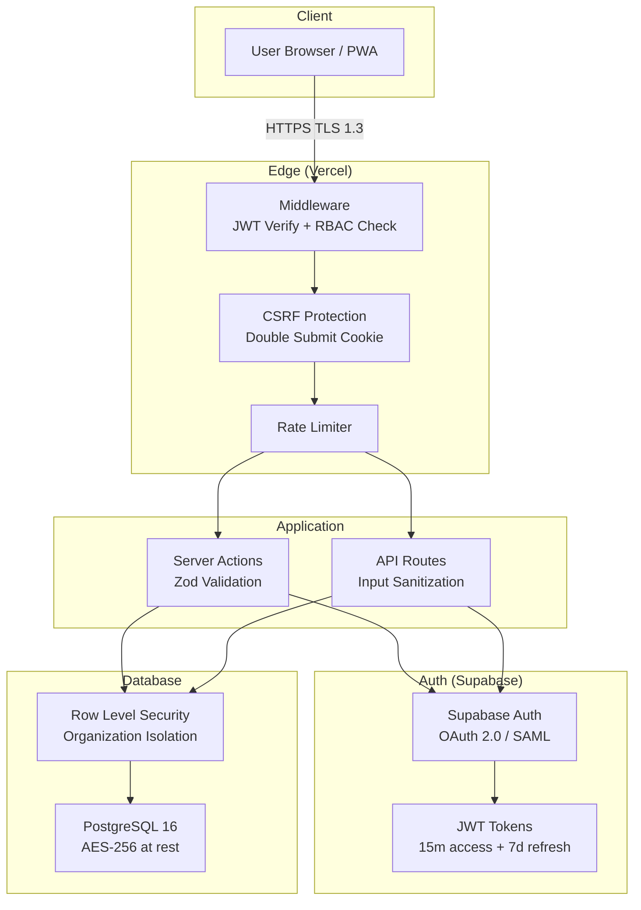
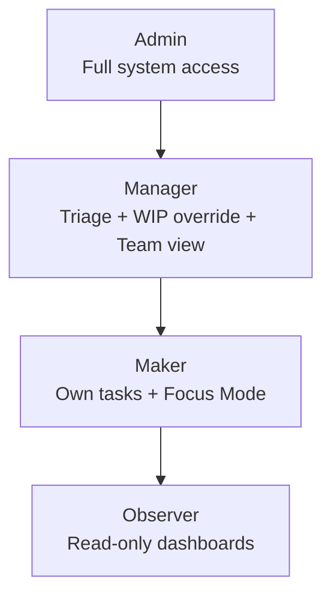

# MÔ HÌNH BẢO MẬT — Tulie Workspace

**Phiên bản:** 1.0  
**Ngày:** 2026-03-19  
**Tham chiếu:** [PRD.md](../PRD.md) §8, §13.3, §13.4

---

## 1. Tổng quan Kiến trúc Bảo mật



---

## 2. Authentication

### 2.1 Auth Flows

| Flow | Dùng cho | Method |
|------|---------|--------|
| **Email/Password** | Sign up / Login | Supabase Auth |
| **OAuth 2.0** | Google, GitHub login | Supabase OAuth |
| **SAML** | Enterprise SSO | Supabase SAML (Phase 3) |
| **Magic Link** | Passwordless login | Supabase Magic Link |
| **API Key** | Server-to-server | Custom header `X-API-Key` |
| **Personal Access Token** | Automation scripts | Bearer token |

### 2.2 JWT Token Strategy

| Token | TTL | Storage | Refresh |
|-------|-----|---------|---------|
| Access Token | 15 minutes | Memory (không localStorage) | Via refresh token |
| Refresh Token | 7 days | HttpOnly Secure Cookie | Auto-rotate on use |

**Implementation:**

```typescript
// middleware.ts
import { createServerClient } from '@supabase/ssr'

export async function middleware(request: NextRequest) {
    const supabase = createServerClient(/* ... */)
    const { data: { session } } = await supabase.auth.getSession()
    
    if (!session) {
        return NextResponse.redirect(new URL('/login', request.url))
    }
    
    // Auto-refresh token nếu sắp hết hạn
    const { data: { session: refreshed } } = await supabase.auth.refreshSession()
    
    return NextResponse.next()
}

export const config = {
    matcher: ['/(dashboard)/:path*', '/api/v1/:path*']
}
```

### 2.3 Session Management

- **Session Invalidation:** Khi user đổi mật khẩu → revoke tất cả sessions.
- **Concurrent Sessions:** Cho phép tối đa 5 sessions/user. Session thứ 6 → revoke session cũ nhất.
- **Inactive Timeout:** Auto-logout sau 30 phút không interaction.
- **Device Tracking:** Lưu device fingerprint + IP cho audit.

---

## 3. Authorization (RBAC)

### 3.1 Role Hierarchy



### 3.2 Permission Matrix

| Resource / Action | Admin | Manager | Maker | Observer |
|-------------------|:-----:|:-------:|:-----:|:--------:|
| **Tasks** | | | | |
| Create task (for anyone) | ✅ | ✅ | ❌ | ❌ |
| Create task (for self) | ✅ | ✅ | ✅ | ❌ |
| View all tasks (org) | ✅ | ✅ | ❌ | ❌ |
| View assigned tasks | ✅ | ✅ | ✅ | ❌ |
| View project summary | ✅ | ✅ | ❌ | ✅ |
| Update any task | ✅ | ✅ (team) | ❌ | ❌ |
| Update own task | ✅ | ✅ | ✅ | ❌ |
| Delete task | ✅ | ✅ (own created) | ❌ | ❌ |
| **WIP & Triage** | | | | |
| View Quarantine | ✅ | ✅ | ❌ | ❌ |
| Process Trade-off | ✅ | ✅ | ❌ | ❌ |
| Override WIP | ✅ | ✅ | ❌ | ❌ |
| View Backlog (full list) | ✅ | ✅ | ❌ | ❌ |
| View Backlog (badge count) | ✅ | ✅ | ✅ | ❌ |
| **Focus & View** | | | | |
| Enter Focus Mode | ✅ | ❌ | ✅ | ❌ |
| View Focus stats (own) | ✅ | ✅ | ✅ | ❌ |
| View Focus stats (team) | ✅ | ✅ | ❌ | ❌ |
| **Analytics** | | | | |
| View personal dashboard | ✅ | ✅ | ✅ | ❌ |
| View team dashboard | ✅ | ✅ | ❌ | ❌ |
| View org dashboard | ✅ | ❌ | ❌ | ✅ (limited) |
| Export reports | ✅ | ✅ | ❌ | ✅ |
| **Administration** | | | | |
| Manage users | ✅ | ❌ | ❌ | ❌ |
| Configure WIP rules | ✅ | ✅ (team) | ❌ | ❌ |
| Manage cycles | ✅ | ✅ | ❌ | ❌ |
| Manage templates | ✅ | ✅ | ❌ | ❌ |
| Organization settings | ✅ | ❌ | ❌ | ❌ |
| Webhooks/API Keys | ✅ | ❌ | ❌ | ❌ |

### 3.3 RBAC Enforcement Implementation

```typescript
// lib/auth/rbac.ts
type Role = 'admin' | 'manager' | 'maker' | 'observer'

type Permission = 
    | 'task.create' | 'task.create_any' | 'task.view_all' | 'task.update_any' | 'task.delete'
    | 'quarantine.view' | 'quarantine.process' | 'wip.override'
    | 'focus.enter' | 'analytics.team' | 'analytics.org'
    | 'admin.users' | 'admin.settings'

const ROLE_PERMISSIONS: Record<Role, Permission[]> = {
    admin: ['*'], // All permissions
    manager: [
        'task.create', 'task.create_any', 'task.view_all', 'task.update_any',
        'quarantine.view', 'quarantine.process', 'wip.override',
        'analytics.team',
    ],
    maker: [
        'task.create', 'focus.enter',
    ],
    observer: [
        'analytics.org', // limited
    ],
}

export function hasPermission(userRole: Role, permission: Permission): boolean {
    const perms = ROLE_PERMISSIONS[userRole]
    return perms.includes('*') || perms.includes(permission)
}

// Server Action usage
export async function processTradeOff(taskId: string, decision: TradeOffDecision) {
    const user = await getCurrentUser()
    if (!hasPermission(user.role_type, 'quarantine.process')) {
        throw new ForbiddenError('INSUFFICIENT_PERMISSIONS')
    }
    // ... process
}
```

---

## 4. Row Level Security (RLS) — Chi tiết

### 4.1 Core Principle: Organization Isolation

Mọi data được isolate theo `organization_id`. User chỉ thấy data thuộc org mình.

### 4.2 RLS Policy Summary

| Table | SELECT | INSERT | UPDATE | DELETE |
|-------|--------|--------|--------|--------|
| `tasks` | Same org (via project) | Own created + same org | Assignee / Manager | Admin/Manager only |
| `comments` | Same org (via task) | Own + same org | Own comments only | Own comments only |
| `notifications` | Own only | System only | Own (mark read) | Own only |
| `focus_sessions` | Own only | Own only | Own only | Own only |
| `quick_strike_log` | Own only | Own only | — | Own only |
| `user_preferences` | Own only | Own only | Own only | — |
| `saved_views` | Own + shared (team) | Own only | Own only | Own only |

### 4.3 Sensitive Data Protection

| Data | Ai thấy | Ai KHÔNG thấy |
|------|---------|---------------|
| `hofstadter_multiplier` (task) | Manager, Admin | **Maker** (PRD NL-5) |
| WIP override logs | Manager, Admin | Maker (ẩn trên UI) |
| Backlog full list | Manager, Admin | **Maker** (chỉ badge count) |
| Focus session details | User bản thân | Các Maker khác |
| Trade-off reasons | Manager, Admin | Observer |
| Internal notes (comments pinned) | Team members | Observer |

**Implementation — Hide Hofstadter from Maker:**

```typescript
// lib/services/task.service.ts
export async function getTask(taskId: string, userId: string) {
    const user = await getUser(userId)
    const task = await db.from('tasks').select('*').eq('id', taskId).single()
    
    // Strip sensitive fields for Maker
    if (user.role_type === 'maker') {
        delete task.hofstadter_multiplier
        delete task.scheduled_duration_hours
    }
    
    return task
}
```

---

## 5. Input Validation & Sanitization

### 5.1 Validation Layers

```
Client (React Hook Form + Zod) 
    → Server (Zod schema re-validate) 
        → Database (CHECK constraints)
```

### 5.2 Validation Rules

```typescript
// lib/validators/task.schema.ts
import { z } from 'zod'

export const createTaskSchema = z.object({
    title: z.string()
        .min(10, 'Title must be at least 10 characters')
        .max(500)
        .refine(
            (val) => /^[A-ZÀÁÂÃÈÉÊÌÍÒÓÔÕÙÚĂĐĨŨƠƯẠ-ỹ]/.test(val),
            'Title should start with a capital letter/verb'
        ),
    description: z.string().max(50000).optional(),
    project_id: z.string().uuid(),
    estimated_effort_hours: z.number().positive().max(999),
    is_urgent: z.boolean(),
    is_important: z.boolean(),
    requested_deadline: z.string().datetime().optional(),
    assigned_to: z.string().uuid().optional(),
    tags: z.array(z.string()).max(10).optional(),
})

export const tradeOffSchema = z.object({
    decision: z.enum(['swap', 'add_resource', 'reduce_scope', 'extend_deadline', 'reject']),
    affected_task_id: z.string().uuid().optional(),
    reason: z.string().min(20, 'Reason must be at least 20 characters').max(2000),
})
```

### 5.3 Sanitization

| Input type | Sanitization |
|------------|-------------|
| Text fields | HTML escape, trim whitespace |
| Rich text (description) | DOMPurify whitelist: headings, lists, code, links |
| File names | Remove special chars, limit to 255 chars |
| URLs | Validate protocol (https only), block javascript: |
| SQL | Parameterized queries only (Supabase client) |

---

## 6. CSRF Protection

**Strategy: Double Submit Cookie** (phù hợp với SPA + Server Actions)

```typescript
// middleware.ts — CSRF for Server Actions
export async function middleware(request: NextRequest) {
    if (request.method !== 'GET' && request.method !== 'HEAD') {
        const csrfCookie = request.cookies.get('csrf-token')?.value
        const csrfHeader = request.headers.get('X-CSRF-Token')
        
        if (!csrfCookie || !csrfHeader || csrfCookie !== csrfHeader) {
            return NextResponse.json(
                { error: { code: 'CSRF_VALIDATION_FAILED', message: 'Invalid CSRF token' } },
                { status: 403 }
            )
        }
    }
    return NextResponse.next()
}
```

---

## 7. Data Protection & Compliance

### 7.1 Encryption

| Layer | Method | Standard |
|-------|--------|----------|
| In Transit | HTTPS mandatory | TLS 1.3 |
| At Rest (DB) | Supabase managed | AES-256 |
| At Rest (Storage) | Supabase Storage | AES-256 |
| Sensitive fields | Application-level | AES-256-GCM (API keys, tokens) |
| Backup | Encrypted | AES-256 |

### 7.2 GDPR Compliance

| Yêu cầu | Implementation |
|----------|---------------|
| Right to Access | API endpoint: `GET /api/v1/me/data-export` → JSON dump |
| Right to Erasure | API endpoint: `DELETE /api/v1/me/account` → cascade delete + anonymize logs |
| Data Portability | Export user data as JSON/CSV |
| Consent Management | Explicit opt-in for analytics, email notifications |
| Data Processing Agreement | Template cung cấp cho enterprise customers |

### 7.3 Audit Trail

Mọi hành động quan trọng đều được log trong `task_logs`:

| Action | Logged Data |
|--------|------------|
| `status_change` | from_status, to_status, user |
| `wip_override` | reason, approved_by |
| `trade_off_decided` | decision, reason, affected_task |
| `task_assigned` | from_user, to_user |
| `task_deleted` | deleted_by, task_snapshot |
| `login` | IP, device, timestamp |
| `permission_change` | role_from, role_to, changed_by |

---

## 8. Dependency Security

| Tool | Purpose | Schedule |
|------|---------|----------|
| Dependabot (GitHub) | Dependency vulnerabilities | Daily scan |
| Snyk | Deep dependency analysis | Weekly |
| CodeQL | Static code analysis | On PR |
| npm audit | Package vulnerabilities | On CI |

---

## 9. Security Checklist (per Phase)

### Phase 1 (MVP)

- [x] Supabase Auth (email/password + OAuth)
- [x] JWT with auto-refresh
- [x] RLS on all tables
- [x] RBAC middleware
- [x] Input validation (Zod)
- [x] CSRF protection
- [x] Rate limiting
- [x] HTTPS enforced
- [x] Security headers (CSP, HSTS, X-Frame-Options)

### Phase 2

- [ ] API Key management
- [ ] Webhook signature verification
- [ ] Audit log dashboard
- [ ] IP allowlist for API keys

### Phase 3

- [ ] SAML SSO
- [ ] Personal Access Tokens
- [ ] SOC 2 Type II preparation
- [ ] Penetration testing

---

> **Tài liệu liên quan:**
> - [PRD.md](../PRD.md) §8 — Phân quyền, §13.3 — Security, §13.4 — Compliance
> - [02_DATABASE_SCHEMA.md](./02_DATABASE_SCHEMA.md) — RLS SQL policies
> - [03_API_SPEC.md](./03_API_SPEC.md) — API auth & error format
