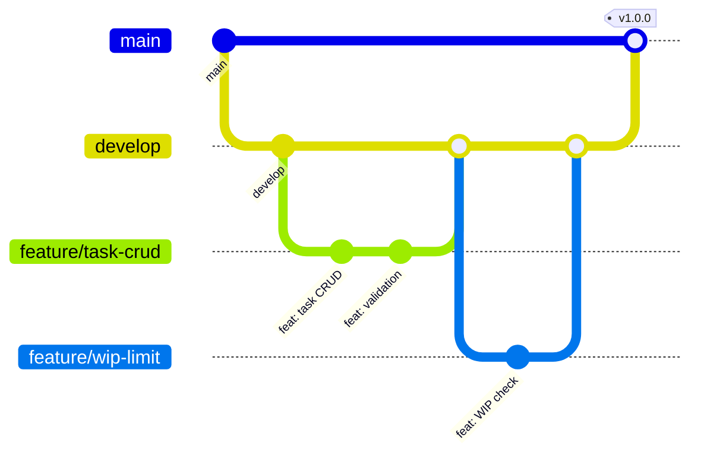

# ENGINEERING GUIDELINES — FlowGuard

**Phiên bản:** 1.0  
**Ngày:** 2026-03-19  
**Áp dụng cho:** Toàn bộ codebase FlowGuard

---

## 1. Nguyên tắc Chung

| # | Nguyên tắc | Mô tả |
|---|-----------|-------|
| 1 | **Type Safety First** | TypeScript strict mode. Không dùng `any`. |
| 2 | **Server-first** | Ưu tiên RSC + Server Actions. Client component chỉ khi cần interactivity. |
| 3 | **Colocation** | File liên quan nằm cùng thư mục (component + style + test + types). |
| 4 | **Single Responsibility** | Mỗi file, function, component chỉ làm 1 việc. |
| 5 | **DRY, but readable** | Đừng lặp code, nhưng đừng trừu tượng hóa quá sớm. |
| 6 | **Convention over Configuration** | Theo chuẩn codebase, không tự sáng tạo pattern mới. |

---

## 2. Code Conventions

### 2.1 TypeScript

```typescript
// ✅ GOOD — Explicit types, const assertions
export const TASK_STATUS = {
    INTAKE: 'intake',
    BACKLOG: 'backlog',
    QUARANTINE: 'quarantine',
    READY: 'ready',
    DOING: 'doing',
    ON_HOLD: 'on_hold',
    IN_REVIEW: 'in_review',
    DONE: 'done',
    REJECTED: 'rejected',
} as const

type TaskStatus = typeof TASK_STATUS[keyof typeof TASK_STATUS]

// ❌ BAD — any, implicit types
const status: any = getStatus()
```

**Quy tắc:**
- `strict: true` trong `tsconfig.json`
- Không dùng `any` — dùng `unknown` rồi type guard
- Interface cho data shape, Type cho union/utility
- Zod schema → infer type: `type Task = z.infer<typeof taskSchema>`

### 2.2 Naming Conventions

| Loại | Convention | Ví dụ |
|------|-----------|-------|
| **Files** | kebab-case | `task-card.tsx`, `wip.service.ts` |
| **Components** | PascalCase | `TaskCard`, `WipBlockDialog` |
| **Functions** | camelCase | `checkWipLimit()`, `classifyEisenhower()` |
| **Constants** | UPPER_SNAKE | `MAX_WIP_LIMIT`, `CYCLE_WEEKS` |
| **Types/Interfaces** | PascalCase | `TaskStatus`, `WipCheckResult` |
| **CSS variables** | kebab-case with prefix | `--fg-color-red`, `--fg-spacing-md` |
| **Database columns** | snake_case | `created_at`, `assigned_to` |
| **API endpoints** | kebab-case | `/api/v1/quick-strike` |
| **Env variables** | UPPER_SNAKE with prefix | `NEXT_PUBLIC_SUPABASE_URL` |

### 2.3 File Naming & Structure

```
components/
├── task/
│   ├── task-card.tsx          # Component
│   ├── task-card.test.tsx     # Test
│   ├── task-form.tsx
│   └── index.ts               # Public exports
│
├── ui/                         # Shadcn/UI base (auto-generated)
│   ├── button.tsx
│   └── dialog.tsx
```

**Quy tắc file:**
- 1 component = 1 file. Không export nhiều component từ 1 file.
- File > 200 lines → cân nhắc tách.
- `index.ts` chỉ dùng cho re-export, không chứa logic.

### 2.4 Import Order

```typescript
// 1. React / Next.js
import { useState, useEffect } from 'react'
import { useRouter } from 'next/navigation'

// 2. Third-party libraries
import { z } from 'zod'
import { useQuery } from '@tanstack/react-query'

// 3. Internal - lib
import { checkWipLimit } from '@/lib/services/wip.service'
import { createTaskSchema } from '@/lib/validators/task.schema'

// 4. Internal - components
import { Button } from '@/components/ui/button'
import { TaskCard } from '@/components/task'

// 5. Internal - types
import type { Task, TaskStatus } from '@/types/task.types'

// 6. Styles (nếu cần)
import './task-card.css'
```

Dùng ESLint plugin `import/order` để enforce tự động.

---

## 3. React & Next.js Patterns

### 3.1 Server vs Client Components

```typescript
// ✅ Default: Server Component (no 'use client')
// app/(dashboard)/board/page.tsx
import { getBoardTasks } from '@/lib/services/task.service'

export default async function BoardPage() {
    const tasks = await getBoardTasks() // Direct DB call
    return <BoardView tasks={tasks} />
}

// ✅ Client Component: only when needed
// components/board/board-column.tsx
'use client'
import { useDraggable } from '@dnd-kit/core'

export function BoardColumn({ tasks }: { tasks: Task[] }) {
    // Needs browser APIs (drag & drop)
}
```

**Khi nào dùng `'use client'`:**
- `useState`, `useEffect`, `useRef`
- Event handlers (`onClick`, `onChange`)
- Browser APIs (drag & drop, localStorage, WebSocket)
- Third-party hooks (React Query, Zustand)

### 3.2 Server Actions Pattern

```typescript
// lib/actions/task.actions.ts
'use server'

import { revalidatePath } from 'next/cache'
import { createTaskSchema } from '@/lib/validators/task.schema'
import { checkWipLimit } from '@/lib/services/wip.service'

export async function createTask(formData: FormData) {
    // 1. Auth check
    const user = await getCurrentUser()
    if (!user) throw new AuthError('UNAUTHENTICATED')

    // 2. Validate
    const parsed = createTaskSchema.safeParse(Object.fromEntries(formData))
    if (!parsed.success) {
        return { error: parsed.error.flatten() }
    }

    // 3. Business logic
    const eisenhower = classifyEisenhower(parsed.data.is_urgent, parsed.data.is_important)

    // 4. Database operation
    const task = await db.from('tasks').insert({ ...parsed.data, eisenhower_quadrant: eisenhower })

    // 5. Revalidate
    revalidatePath('/board')

    return { data: task }
}
```

### 3.3 Error Handling Pattern

```typescript
// lib/errors.ts
export class AppError extends Error {
    constructor(
        public code: string,
        message: string,
        public statusCode: number = 400,
        public details?: Record<string, unknown>
    ) {
        super(message)
    }
}

export class WipLimitError extends AppError {
    constructor(currentDoing: number, limit: number, doingTasks: Task[]) {
        super(
            'WIP_LIMIT_EXCEEDED',
            `WIP limit reached (${currentDoing}/${limit})`,
            409,
            { current_doing: currentDoing, wip_limit: limit, doing_tasks: doingTasks }
        )
    }
}

export class ForbiddenError extends AppError {
    constructor(code = 'INSUFFICIENT_PERMISSIONS') {
        super(code, 'You do not have permission to perform this action', 403)
    }
}
```

---

## 4. Git Workflow

### 4.1 Branch Strategy



| Branch | Mục đích | Deploy to |
|--------|---------|-----------|
| `main` | Production-ready | Production |
| `develop` | Integration branch | Staging |
| `feature/*` | Feature development | Preview |
| `bugfix/*` | Bug fixes | Preview |
| `hotfix/*` | Emergency fixes | Production (cherrypick) |

### 4.2 Branch Naming

```
feature/FG-{task_id}/{short-description}
bugfix/FG-{task_id}/{short-description}
hotfix/FG-{task_id}/{short-description}

# Ví dụ:
feature/FG-042/wip-enforcement-dialog
bugfix/FG-105/focus-mode-timer-reset
```

### 4.3 Commit Convention

```
<type>(<scope>): <description>

[FG-{task_id}] Optional body with more details

# Types:
feat     — New feature
fix      — Bug fix
refactor — Code change that neither fixes a bug nor adds a feature
docs     — Documentation only
style    — Formatting, missing semi-colons, etc
test     — Adding tests
chore    — Build process, CI, dependencies
perf     — Performance improvement

# Ví dụ:
feat(task): add WIP limit enforcement dialog
[FG-042] Block user from exceeding WIP limit with actionable options.

fix(focus): reset timer on exit focus mode
[FG-105]
```

### 4.4 Pull Request Template

```markdown
## Mô tả
<!-- Thay đổi gì? Tại sao? -->

## Task ID
FG-XXX

## Loại thay đổi
- [ ] Feature
- [ ] Bug fix
- [ ] Refactor
- [ ] Docs

## Screenshots / Recordings
<!-- UI changes: đính kèm screenshot/video -->

## Checklist
- [ ] TypeScript check pass (`pnpm type-check`)
- [ ] ESLint pass (`pnpm lint`)
- [ ] Tests pass (`pnpm test`)
- [ ] Responsive tested (mobile + desktop)
- [ ] Accessibility tested (keyboard nav + screen reader)
- [ ] Self-reviewed code
- [ ] No `console.log` or `any` left
```

---

## 5. Code Quality Tools

### 5.1 ESLint Configuration

```json
{
    "extends": [
        "next/core-web-vitals",
        "next/typescript",
        "plugin:import/recommended",
        "plugin:import/typescript"
    ],
    "rules": {
        "@typescript-eslint/no-explicit-any": "error",
        "@typescript-eslint/no-unused-vars": "error",
        "import/order": ["error", {
            "groups": ["builtin", "external", "internal", "parent", "sibling"],
            "newlines-between": "always"
        }],
        "no-console": "warn",
        "react/no-unescaped-entities": "off"
    }
}
```

### 5.2 Prettier Configuration

```json
{
    "semi": false,
    "singleQuote": true,
    "tabWidth": 4,
    "trailingComma": "all",
    "printWidth": 100,
    "plugins": ["prettier-plugin-tailwindcss"]
}
```

### 5.3 CI Checks

Mọi PR phải pass trước khi merge:

```yaml
# .github/workflows/ci.yml
name: CI
on: [pull_request]

jobs:
    quality:
        runs-on: ubuntu-latest
        steps:
            - uses: actions/checkout@v4
            - uses: pnpm/action-setup@v2
            - run: pnpm install --frozen-lockfile
            - run: pnpm type-check    # TypeScript
            - run: pnpm lint           # ESLint
            - run: pnpm test           # Vitest
            - run: pnpm build          # Build check
```

---

## 6. Testing Strategy

### 6.1 Test Pyramid

| Layer | Tool | Coverage Target | Ví dụ |
|-------|------|:--------------:|-------|
| **Unit** | Vitest | 80%+ | Services: `wip.service.test.ts` |
| **Integration** | Vitest + Supabase local | Key flows | Task creation + WIP check |
| **E2E** | Playwright | Critical paths | Login → Create task → Focus Mode → Done |

### 6.2 Test Naming

```typescript
describe('WipService', () => {
    describe('checkWipLimit', () => {
        it('should allow task when under WIP limit', async () => { ... })
        it('should block task when at WIP limit', async () => { ... })
        it('should allow override for managers', async () => { ... })
    })
})
```

### 6.3 Test File Location

```
# Colocation: test cạnh source file
src/lib/services/wip.service.ts
src/lib/services/wip.service.test.ts

# E2E: trong folder riêng
tests/e2e/task-lifecycle.spec.ts
tests/e2e/focus-mode.spec.ts
```

---

## 7. Performance Guidelines

| Metric | Budget | Đo bằng |
|--------|--------|---------|
| LCP | < 2.5s | Vercel Analytics |
| FCP | < 1.5s | Lighthouse |
| TTI | < 3s | Lighthouse |
| Bundle (initial) | < 200KB gzipped | `next build` output |
| API P95 | < 200ms | Sentry |
| WebSocket latency | < 50ms | Custom monitoring |

**Best practices:**
- Dùng `dynamic()` cho components nặng (charts, editors)
- Image optimization qua `next/image`
- Prefetch data cho route transitions
- Debounce search input (300ms)
- Virtual scroll cho danh sách > 100 items

---

## 8. Environment Variables

```bash
# .env.local.example

# Supabase
NEXT_PUBLIC_SUPABASE_URL=https://xxx.supabase.co
NEXT_PUBLIC_SUPABASE_ANON_KEY=eyJh...
SUPABASE_SERVICE_ROLE_KEY=eyJh...       # Server-only

# App
NEXT_PUBLIC_APP_URL=http://localhost:3000
NEXT_PUBLIC_APP_NAME=FlowGuard

# Email
RESEND_API_KEY=re_...                    # Server-only

# Monitoring
SENTRY_DSN=https://...
NEXT_PUBLIC_SENTRY_DSN=https://...

# Cron secret (Vercel Cron)
CRON_SECRET=xxx                          # Server-only
```

**Quy tắc:**
- `NEXT_PUBLIC_*` → exposed to browser. Chỉ dùng cho public values.
- Secrets (API keys, service role key) → KHÔNG có prefix `NEXT_PUBLIC_`.
- `.env.local` → development. `.env.production` → production (Vercel env vars).

---

> **Tài liệu liên quan:**
> - [01_SYSTEM_ARCHITECTURE.md](./01_SYSTEM_ARCHITECTURE.md) — Project structure
> - [04_SECURITY_MODEL.md](./04_SECURITY_MODEL.md) — Security patterns
> - [07_ERROR_CODE_CATALOG.md](./07_ERROR_CODE_CATALOG.md) — Error handling
