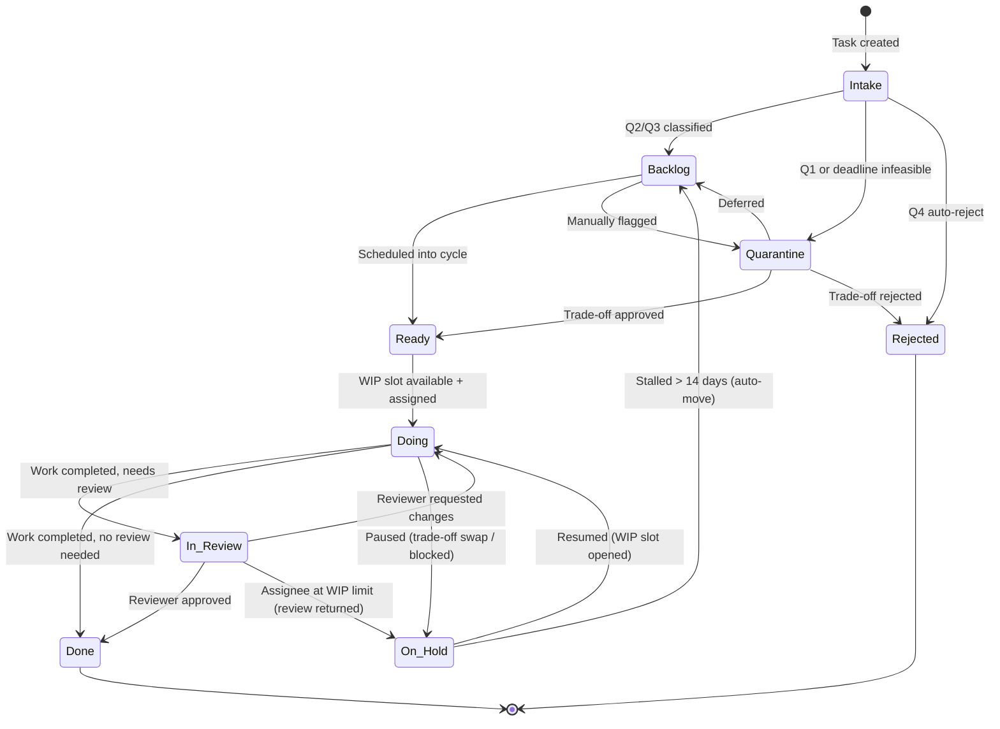
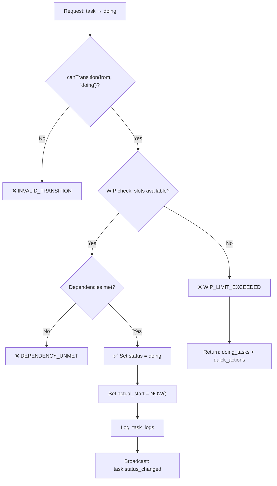
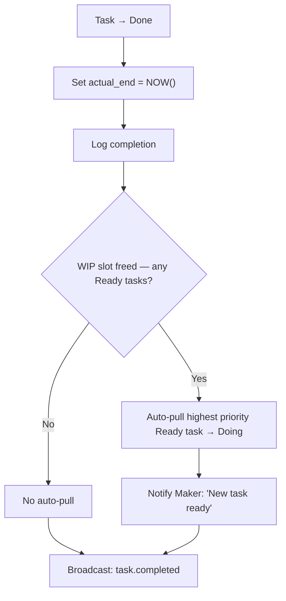
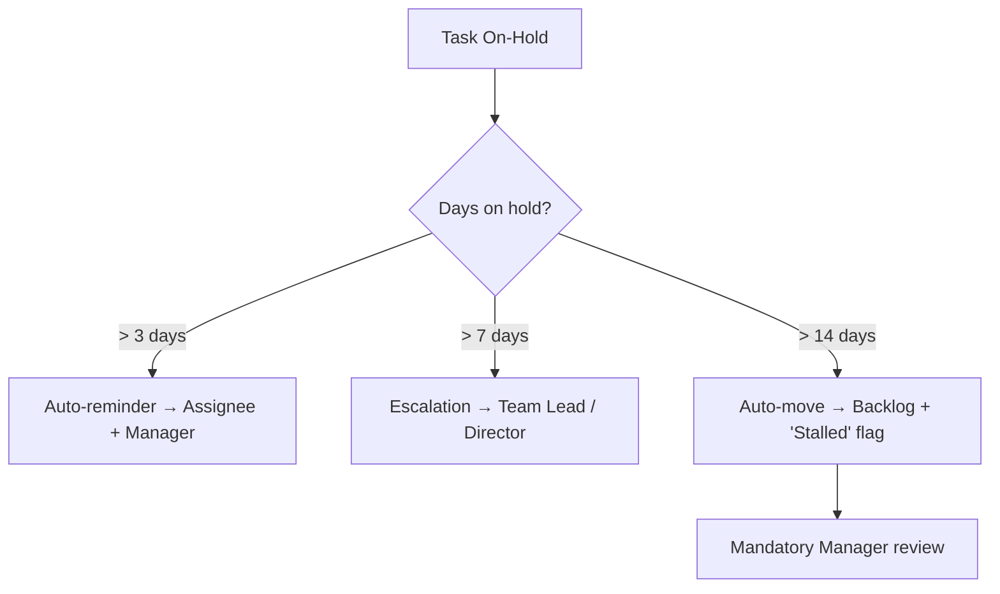
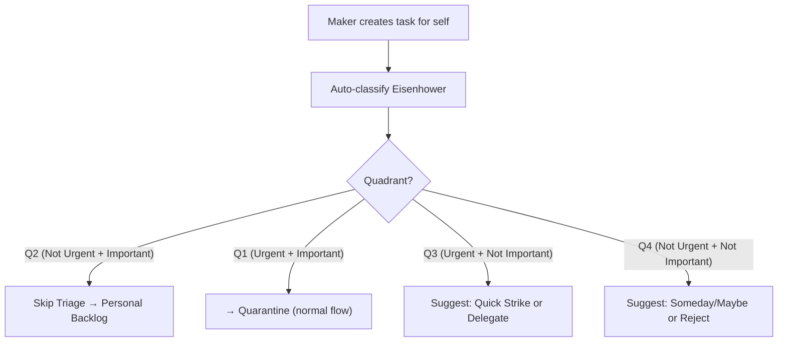

# TASK WORKFLOW — FlowGuard

**Phiên bản:** 1.0  
**Ngày:** 2026-03-19  
**Tham chiếu:** [PRD.md](../PRD.md) §4.3.4, §4.3.5, §5

---

## 1. State Machine Diagram



---

## 2. Status Definitions

| Status | Code | Mô tả | Visible to |
|--------|------|--------|-----------|
| **Intake** | `intake` | Vừa created, chưa phân loại Eisenhower | Manager |
| **Backlog** | `backlog` | Đã phân loại, chờ lên lịch vào cycle | Manager |
| **Quarantine** | `quarantine` | Cần triage: Q1, deadline conflict, hoặc manual flag | Manager |
| **Ready** | `ready` | Đã duyệt + lên lịch, chờ WIP slot | Manager, Maker (badge) |
| **Doing** | `doing` | Đang thực hiện — chặn bởi WIP Limit | Maker (primary) |
| **On-Hold** | `on_hold` | Tạm dừng (trade-off / blocked / review returned) | Manager, Maker |
| **In Review** | `in_review` | Hoàn thành, đang chờ review/QA | Manager, Reviewer |
| **Done** | `done` | Hoàn tất | All (trong report) |
| **Rejected** | `rejected` | Bị từ chối tại Triage | Requester |

---

## 3. Transition Rules

### 3.1 Allowed Transitions Matrix

| From ↓ / To → | intake | backlog | quarantine | ready | doing | on_hold | in_review | done | rejected |
|----------------|:------:|:-------:|:----------:|:-----:|:-----:|:-------:|:---------:|:----:|:--------:|
| **intake** | — | ✅ | ✅ | ❌ | ❌ | ❌ | ❌ | ❌ | ✅ |
| **backlog** | ❌ | — | ✅ | ✅ | ❌ | ❌ | ❌ | ❌ | ❌ |
| **quarantine** | ❌ | ✅ | — | ✅ | ❌ | ❌ | ❌ | ❌ | ✅ |
| **ready** | ❌ | ✅ | ❌ | — | ✅* | ❌ | ❌ | ❌ | ❌ |
| **doing** | ❌ | ❌ | ❌ | ❌ | — | ✅ | ✅ | ✅ | ❌ |
| **on_hold** | ❌ | ✅** | ❌ | ❌ | ✅* | — | ❌ | ❌ | ❌ |
| **in_review** | ❌ | ❌ | ❌ | ❌ | ✅*** | ✅**** | — | ✅ | ❌ |
| **done** | ❌ | ❌ | ❌ | ❌ | ❌ | ❌ | ❌ | — | ❌ |
| **rejected** | ❌ | ❌ | ❌ | ❌ | ❌ | ❌ | ❌ | ❌ | — |

**Footnotes:**
- `*` **Ready → Doing / On-Hold → Doing:** Requires WIP check
- `**` **On-Hold → Backlog:** Auto-move khi stalled > 14 days
- `***` **In Review → Doing:** Review returned — request changes
- `****` **In Review → On-Hold:** Review returned but assignee at WIP limit

### 3.2 Transition Logic (Code)

```typescript
// lib/constants/task-status.ts

export const VALID_TRANSITIONS: Record<TaskStatus, TaskStatus[]> = {
    intake:      ['backlog', 'quarantine', 'rejected'],
    backlog:     ['quarantine', 'ready'],
    quarantine:  ['backlog', 'ready', 'rejected'],
    ready:       ['backlog', 'doing'],
    doing:       ['on_hold', 'in_review', 'done'],
    on_hold:     ['backlog', 'doing'],
    in_review:   ['doing', 'on_hold', 'done'],
    done:        [],
    rejected:    [],
}

export function canTransition(from: TaskStatus, to: TaskStatus): boolean {
    return VALID_TRANSITIONS[from]?.includes(to) ?? false
}
```

```typescript
// lib/services/task.service.ts

export async function transitionTask(
    taskId: string, 
    newStatus: TaskStatus, 
    userId: string,
    note?: string
): Promise<TransitionResult> {
    const task = await getTask(taskId)
    const user = await getUser(userId)
    
    // 1. Validate transition is allowed
    if (!canTransition(task.status, newStatus)) {
        throw new InvalidTransitionError(task.status, newStatus)
    }
    
    // 2. Role check
    validateTransitionPermission(user, task, newStatus)
    
    // 3. Business rules
    switch (newStatus) {
        case 'doing':
            return handleTransitionToDoing(task, user)
        case 'done':
            return handleTransitionToDone(task, user)
        case 'in_review':
            return handleTransitionToInReview(task, user)
        case 'on_hold':
            return handleTransitionToOnHold(task, user, note)
        default:
            return executeTransition(task, newStatus, user, note)
    }
}
```

---

## 4. Business Rules per Transition

### 4.1 → Doing (WIP Check)



**Implementation:**

```typescript
async function handleTransitionToDoing(task: Task, user: User): Promise<TransitionResult> {
    // WIP Check
    const wip = await checkWipLimit(user.id)
    if (!wip.is_within_limit) {
        throw new WipLimitError(wip.current_doing, wip.wip_limit, wip.doing_tasks)
    }
    
    // Dependency Check
    const unmetDeps = await getUnmetDependencies(task.id)
    if (unmetDeps.length > 0) {
        throw new DependencyUnmetError(task.id, unmetDeps)
    }
    
    // Execute
    const updated = await db.from('tasks')
        .update({ status: 'doing', actual_start: new Date() })
        .eq('id', task.id)
        .select()
        .single()
    
    return { task: updated, action: 'transitioned_to_doing' }
}
```

### 4.2 → Done (Auto-pull)



**Auto-pull logic:**

```typescript
async function handleTransitionToDone(task: Task, user: User): Promise<TransitionResult> {
    // Complete the task
    const updated = await db.from('tasks')
        .update({ status: 'done', actual_end: new Date() })
        .eq('id', task.id)
        .select().single()
    
    // Auto-pull: get highest priority Ready task for this user
    const nextTask = await db.from('tasks')
        .select()
        .eq('assigned_to', user.id)
        .eq('status', 'ready')
        .order('priority', { ascending: false })
        .limit(1)
        .maybeSingle()
    
    if (nextTask) {
        // Check WIP again (safety)
        const wip = await checkWipLimit(user.id)
        if (wip.is_within_limit) {
            await db.from('tasks')
                .update({ status: 'doing', actual_start: new Date() })
                .eq('id', nextTask.id)
            
            await sendNotification(user.id, {
                type: 'info',
                title: 'Task mới đã sẵn sàng',
                content: `"${nextTask.title}" đã tự động chuyển sang Doing.`,
                related_task_id: nextTask.id,
            })
        }
    }
    
    return { task: updated, auto_pulled: nextTask?.id ?? null }
}
```

### 4.3 In Review → Doing (Request Changes)

| Scenario | Action |
|----------|--------|
| Assignee under WIP limit | Task quay về `Doing` — không tốn thêm slot |
| Assignee at WIP limit | Task → `On-Hold` + flag "Review Returned" |
| Reviewer is different person | Notification sent to assignee |

```typescript
async function handleReviewReturn(task: Task, reviewer: User): Promise<TransitionResult> {
    const assignee = await getUser(task.assigned_to!)
    const wip = await checkWipLimit(assignee.id)
    
    if (wip.current_doing < wip.wip_limit) {
        // Under limit: go back to Doing
        return executeTransition(task, 'doing', reviewer, 'Review returned — request changes')
    } else {
        // At limit: go to On-Hold
        return executeTransition(task, 'on_hold', reviewer, 'Review returned — assignee at WIP limit')
    }
}
```

---

## 5. Edge Cases & Escalation

### 5.1 On-Hold Timeout Escalation



**Cron Job implementation:**

```typescript
// api/v1/cron/on-hold-escalation/route.ts
export async function GET(request: Request) {
    verifyVronSecret(request)
    
    const onHoldTasks = await db.from('tasks')
        .select('*, assigned_to(*)')
        .eq('status', 'on_hold')
    
    for (const task of onHoldTasks) {
        const daysOnHold = differenceInDays(new Date(), task.updated_at)
        
        if (daysOnHold > 14) {
            await transitionTask(task.id, 'backlog', SYSTEM_USER_ID, 'Auto-moved: stalled > 14 days')
            await notifyManager(task, 'STALLED_TASK_REQUIRES_REVIEW')
        } else if (daysOnHold > 7) {
            await escalateToSuperior(task)
        } else if (daysOnHold > 3) {
            await sendReminder(task)
        }
    }
}
```

### 5.2 Carried Over Rules

| Carried Over Count | Visual Flag | Action Required |
|:-:|---|---|
| 1 | 🟡 "Carried Over" (yellow) | Informational |
| 2 | 🔴 "Chronic Carry" (red) | Manager must review: keep / split / cancel |
| 3 | 🚨 Auto-escalate to Director | Director must decide within 3 days |

```typescript
async function handleCycleClose(cycleId: string) {
    const incompleteTasks = await db.from('tasks')
        .select()
        .eq('cycle_id', cycleId)
        .not('status', 'in', '("done","rejected")')
    
    const newCycle = await getUpcomingCycle()
    
    for (const task of incompleteTasks) {
        const newCount = (task.carried_over_count ?? 0) + 1
        
        await db.from('tasks').update({
            cycle_id: newCycle.id,
            carried_over_from: cycleId,
            carried_over_count: newCount,
            status: newCount >= 3 ? 'quarantine' : task.status,
        }).eq('id', task.id)
        
        if (newCount === 2) {
            await notifyManager(task, 'CHRONIC_CARRY_REVIEW_REQUIRED')
        } else if (newCount >= 3) {
            await escalateToDirector(task, 'CARRIED_OVER_3_TIMES')
        }
    }
}
```

### 5.3 Maker Self-Created Tasks (US-12)



---

## 6. Quick Strike Flow (Parallel Track)

Quick Strike hoạt động **hoàn toàn tách biệt** khỏi Task Workflow:

```
User gõ description → Enter → Lưu quick_strike_log → Done ✓
```

**Rules:**
- Không vào task table
- Không ảnh hưởng WIP
- Không qua Triage
- Giới hạn: 200 chars, suggest formal task nếu > 50 chars
- Retention: 90 days
- Thống kê: count/day, tổng saved time

---

## 7. Focus Mode Interaction

| Event | Task Workflow Effect |
|-------|---------------------|
| Maker clicks "Start" on Doing task | Focus Mode activates, timer starts |
| Maker clicks "Done" in Focus Mode | Task → `Done` (or `In Review`), Focus Mode exits |
| Maker clicks "Pause" in Focus Mode | Focus Mode exits, task stays `Doing` |
| Focus Mode exit (any reason) | Prompt: "Ghi chú nhanh?" → save exit_note |
| Focus Mode + notification arrive | Only `Critical` notifications shown |

---

> **Tài liệu liên quan:**
> - [PRD.md](../PRD.md) §4.3.4 — Task Status Flow, §4.3.5 — Edge Cases
> - [03_API_SPEC.md](./03_API_SPEC.md) — API endpoints for status transitions
> - [07_ERROR_CODE_CATALOG.md](./07_ERROR_CODE_CATALOG.md) — Transition error codes
